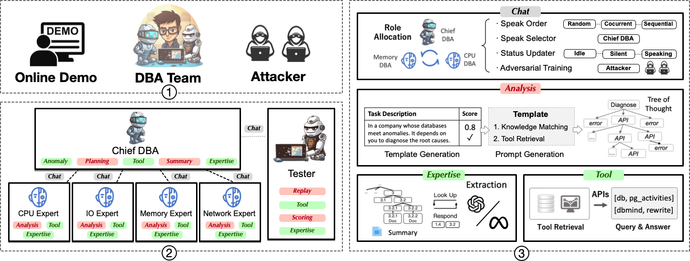

<div align= "center">
    <h1>  基于大模型辅助人类DBA</h1>
</div>

<p align="center">
  <a href="#-features">特点</a> •
  <a href="#-news">最新动态</a> •
  <a href="#-quickstart">快速开始</a> •
  <a href="#-customize">自定义知识和工具</a> •    
  <a href="#-cases">使用案例</a> •
  <a href="#-FAQ">常见问题</a> •  
  <a href="#-community">社区</a> •  
  <a href="#-contributors">贡献者</a>
</p>

<p align="center">
    【<a href="README.md">English</a> | 中文</a>】
</p>


<!-- <br>
<div align="center">

</div>
<br> -->

<br>
    <div align="center">
    
    </div>
<br>

🧗 *D-Bot*，一款基于LLM的数据库管理员，可以从文本来源中获取数据库维护经验，并为目标数据库提供**合理**、**有根据**、**及时**的诊断和优化建议。

<span id="-features"></span>

## 特点
- **有根据的诊断**：D-Bot可以利用相关的数据库知识（使用*document2experience*）提供有根据的诊断。

- **实用工具使用**：D-Bot可以利用监控和优化工具来提高维护能力（使用*tool learning*和*tree of thought*）。

- **深度推理**：与普通的LLM相比，D-Bot将实现竞争性的推理能力，以分析根本原因（使用*multi-llm通信*）。

<br>
<div align="center">

</div>
<br>


<span id="-news"></span>

## 最新动态
<!-- - [x] **[2023/8/23]** 100\% accurate tool calling and refined diagnosis <a href="#-solid_response">🔗</a> -->

- [x] **[2023/9/05]** 统一的诊断框架已经可用！只需一个命令即可开始诊断+工具服务，体验5倍的速度提升！！ <a href="#-diagnosis">🚀 链接</a>

- [x] **[2023/8/25]** 支持基于vue的网站界面。更加灵活和美观！ <a href="#-frontend">🔗 链接</a>

- [x] **[2023/8/22]** 支持60多个API的工具检索 [🔗 链接](multiagents/tools)

- [x] **[2023/8/16]** 支持多级优化功能 <a href="#-tools">🔗 链接</a>

- [x] **[2023/8/10]** 我们的愿景论文已发布（持续更新）

    * *LLM作为数据库管理员.* [[论文]](https://arxiv.org/abs/2308.05481) [[中文解读]](https://mp.weixin.qq.com/s/i0-Fdde7DX9YE1jACxB9_Q) [[推特]](https://twitter.com/omarsar0/status/1689811820272353280?s=61&t=MlkXRcM6bNQYHnTIQVUmVw) [[幻灯片]](materials/slides)

    * *DB-GPT: 大型语言模型遇上数据库.* [[论文]](http://dbgroup.cs.tsinghua.edu.cn/ligl/papers/dbgpt-dse.pdf)

> *D-Bot* 正在不断发展 👫👫<br/> 
> 不要忘记点赞 ⭐ 并关注 👀 以保持最新信息 :)


**演示如何使用D-Bot**

https://github.com/OpenBMB/AgentVerse/assets/11704492/c633419d-afbb-47d4-bb12-6bb512e7af3a


<span id="-quickstart"></span>

<span id="-quickstart"></span>

## 快速入门

<!-- <br>
<div align="center">

</div>
<br> -->


### 文件夹结构

    .
    ├── multiagents
    │   ├── agent_conf                        # 每个代理的设置
    │   ├── agents                            # 不同类型代理的实现
    │   ├── environments                      # 例如，聊天顺序 / 聊天更新 / 终端条件
    │   ├── knowledge                         # 文档中的诊断经验
    │   ├── llms                              # 支持的模型
    │   ├── memory                            # 聊天历史的内容和摘要
    │   ├── response_formalize_scripts        # 模型响应的无用内容删除
    │   ├── tools                             # 用于模型的外部监控/优化工具
    │   └── utils                             # 其他功能（例如，数据库/JSON/YAML操作）


### 1. 先决条件

- PostgreSQL v12或更高版本

    > 此外，安装扩展如 *[pg_stat_statements](https://pganalyze.com/docs/install/01_enabling_pg_stat_statements)*（跟踪慢查询）、*[pg_hint_plan](https://pg-hint-plan.readthedocs.io/en/latest/installation.html)*（优化物理运算符）和 *[hypopg](https://github.com/HypoPG/hypopg)*（创建假设索引）。

- Prometheus ~~和Grafana（[教程](https://grafana.com/docs/grafana/latest/get-started/get-started-grafana-prometheus/)）~~

    查看 [prometheus.md](materials/help_documents/prometheus.md) 以获取详细的安装指南。

    > 使用我们基于vue的前端，Grafana不再是必需的。


### 2. 包安装

步骤1：安装Python包。


```bash
pip install -r requirements.txt
```

步骤2：配置环境变量。

- 导出您的OpenAI API密钥
```bash
# macos
export OPENAI_API_KEY="your_api_key_here"
```

```bash
# windows
set OPENAI_API_KEY="your_api_key_here"
```

步骤3：将数据库/异常/Prometheus的设置添加到 tool_config_example.yaml 并重命名为 tool_config.yaml：

    ```bash
    POSTGRESQL:
      host: 182.92.xxx.x
      port: 5432
      user: xxxx
      password: xxxxx
      dbname: postgres

    BENCHSERVER:
      server_address: 8.131.xxx.xx
      username: root
      password: xxxxx
      remote_directory: /root/benchmark

    PROMETHEUS:
      api_url: http://8.131.xxx.xx:9090/
      postgresql_exporter_instance: 172.27.xx.xx:9187
      node_exporter_instance: 172.27.xx.xx:9100
    ```

> 您可以忽略BENCHSERVER的设置，在此版本中未使用。

- 如果通过VPN访问openai服务，请执行以下命令：

```bash
# macos
export https_proxy=http://127.0.0.1:7890 http_proxy=http://127.0.0.1:7890 all_proxy=socks5://127.0.0.1:7890
```

- 测试您的openai密钥

```bash
cd others
python openai_test.py
```

<span id="-diagnosis"></span>

### 3. 诊断和优化

<span id="-frontend"></span>

#### 网站界面

我们还为此环境提供了本地网站演示。您可以使用以下命令启动它：

```shell
# cd website
cd front_demo
rm -rf node_modules/
rm -r package-lock.json
# 第一次运行时安装依赖项（建议使用nodejs，建议使用^16.13.1）
npm install  --legacy-peer-deps
# 返回根目录
cd ..
# 启动本地服务器并打开网站
sh run_demo.sh
```

> 如果安装了多个版本的Python，请在run_demo.sh中仔细决定“python app.py”命令。

成功启动本地服务器后，访问 http://127.0.0.1:9228/ 触发诊断过程。


#### 命令行界面


```shell
python main.py
```


## 支持的异常

在 anomaly_scripts 目录中，我们提供了可能引起典型异常的脚本，例如，

(1) ./run_benchmark_tpcc.sh 或 ./run_db_exception.sh

    示例异常：INSERT_LARGE_DATA、IO_CONTENTION


<details><summary><b>监控仪表盘</b></summary>
<br>
<div align="center">

</div>
<br>
</details>
  
---

(2) ./run_benchmark_job.sh

    示例异常: POOR_JOIN_PERFORMANCE, CPU_CONTENTION


<details><summary><b>监控仪表盘</b></summary>
<br>
<div align="center">

</div>
<br>
</details>

---

(3) ./run_benchmark_tpch.sh

    示例异常: FETCH_LARGE_DATA (lineitem with 28GB); CORRELATED_SUBQUERY

<details><summary><b>监控仪表盘</b></summary>
<br>
<div align="center">

</div>
<br>
</details>

<span id="-customize"></span>

## 自定义您的知识库和工具


#### 1. 知识准备


- 从代码（./knowledge_json/knowledge_from_code）和文档（./knowledge_json/knowledge_from_document）中提取知识。

    - 将代码块添加到 diagnosis_code.txt 文件中 -> 重新运行 extract_knowledge.py 脚本 -> 检查更新结果并同步到 root_causes_dbmind.jsonl。


<span id="-tools"></span>

#### 2. 工具准备


- 工具API（用于优化）


    | 模块                  | 功能 |
    |-------------------------|-----------|
    | [索引推荐](multiagents/tools/index_advisor) (equipped)          | *启发式算法*  |
    | [查询重写](multiagents/tools/query_advisor) (equipped)           | *45条规则*  |
    | [物理hint](multiagents/tools/query_advisor) (equipped)           | *15条规则*  |

    对于[query_rewrite, physical_hint]中的功能，您可以使用api_test.py脚本来验证其有效性。

    如果实际上功能正常工作，请将其附加到相应模块的api.py中。

<span id="-tot"></span>

- 工具使用算法（tree of thought）

    ```bash
    cd tree_of_thought
    python test_database.py
    ```

    > 历史消息可能占用很多tokens，因此仔细决定回合数。

<!-- ## Prompt Template Generation (optional)

Derive *high-quality prompt templates* from a small number of collected samples (splitting into training and evaluation sets), e.g.,

1. Prompts for index tuning optimization

```bash
cd prompt_template_scripts/index_tuning
./run.sh
```

2. Prompts for query rewrite optimization

```bash
cd prompt_template_scripts/query_rewrite
./run.sh
``` -->

<span id="-solid_response"></span>

## 健壮的响应机制

<!-- #### 100% Accurate Tool Calling -->

#### 精细诊断
删除llm响应中的冗余内容。


```python 
cd response_formalize_scripts
python combine_similar_answer.py # test 
```


<details><summary><b>Before Cleaning</b></summary>

```vim
[Chief DBA]: 异常的识别根本原因是由于正在运行的进程数量较多和负载平均值较高，导致CPU使用率高，慢查询以及复杂查询导致了内存使用率高，内存分配不足以及磁盘溢出的可能性。
通过分析其执行计划，识别任何缺失的索引，并相应地调整查询来优化慢查询
通过检查其执行计划，识别任何缺失的索引，并相应地调整查询来优化慢查询
监视和管理节点上运行的进程数量，确保保持在可接受的限制内
调查和解决可能导致高负载平均值的系统或基础架构问题
如果当前的CPU使用率持续高且影响性能，则考虑扩展或添加更多资源到系统中
添加推荐的索引：['movie_info#movie_id'，'movie_companies#movie_id'，'keyword#keyword'，'aka_name#person_id']以降低成本
进一步研究并优化慢查询以获得更好的内存利用率
监视和调整内存分配参数，例如'work_mem'和'shared_buffers'，以优化内存使用
分析查询计划并考虑调整诸如'work_mem'和'shared_buffers'之类的参数，以帮助减少或消除磁盘溢出
```
</details>

<details><summary><b>After Cleaning</b></summary>

```vim
[Chief DBA]: 异常的识别根本原因是由于正在运行的进程数量较多和负载平均值较高，导致CPU使用率高，慢查询以及复杂查询导致了内存使用率高，内存分配不足以及磁盘溢出的可能性。
通过检查其执行计划，识别任何缺失的索引，并相应地调整查询来优化慢查询。
监视和管理节点上运行的进程数量，确保保持在可接受的限制内。
添加推荐的索引：['movie_info#movie_id'，'movie_companies#movie_id'，'keyword#keyword'，'aka_name#person_id']以降低成本。
```
</details>


<span id="-cases"></span>

## 案例

<details><summary><b>MISSING_INDEXES → INDEX_SELECTION</b></summary>

<br>
<div align="center">

</div>
<br>

注意 optimize_index_selection 需要几分钟来探索有益的索引组合。


```vim
[Chief DBA]: 异常始于1691897340，结束于1691897430。

[CPU Agent]: 高CPU使用率的根本原因可能是高负载值、活动进程过多、阻塞进程、高CPU抓取收集器持续时间和熵值过低。
建议查看系统日志，识别任何最近的更改或更新。我们还应该分析其他相关指标，如内存使用率、磁盘I/O、网络流量，并检查特定进程或应用程序的任何异常行为。
----------------------------
(匹配的知识) 高CPU使用率可能是由于正在运行的进程数量较多和负载平均值较高。慢查询也可能导致高CPU使用率。missing_index函数使用工作负载-索引-推荐接口检查所需索引的存在。

[Memory Agent]: 高内存使用率的潜在原因可能是磁盘溢出和内存分配不足。
建议分析查询执行期间的实际资源使用情况，彻底分析查询计划，并评估与内存分配相关的系统配置设置，如'work_mem'和'shared_buffers'。需要更多关于排序溢出计数或哈希溢出计数以及阈值值的信息，以确认是否磁盘溢出是根本原因。如果可用内存持续较低且接近总内存容量，则考虑增加系统的内存分配。
----------------------------
(匹配的知识) disk_spill: 这个函数检查在SQL执行期间是否有可能发生磁盘溢出。如果计划解析信息不可用，则检查排序溢出计数或哈希溢出计数是否超过排序率阈值。如果计划解析信息可用，则计算计划的总成本，并检查排序或哈希操作符的成本率是否超过成本率阈值。如果发现异常操作符详细信息，并且排序或哈希溢出计数大于0，则表明SORT/HASH操作可能会溢出到磁盘上。

[Chief DBA]: 异常的识别根本原因是由于正在运行的进程数量较多和负载平均值较高，导致CPU使用率高，慢查询以及复杂查询导致了内存使用率高，内存分配不足以及磁盘溢出的可能性。
----------------------------
(解决方案) 1. 监视和管理节点上运行的进程数量，确保保持在可接受的限制内。
2. 添加推荐的索引：['movie_info#movie_id'，'movie_companies#movie_id'，'keyword#keyword'，'aka_name#person_id']以降低成本。
3. 分析查询计划并考虑调整诸如'work_mem'和'shared_buffers'之类的参数，以帮助减少或消除磁盘溢出。
4. 调查并解决可能导致高负载平均值的系统或基础架构问题。
```

</details>


<details><summary><b>INSUFFICIENT_MEMORY_ALLOCATION</b></summary>
<br>
<div align="center">

</div>
<br>

```vim
[Chief DBA]: 异常始于1691897340，结束于1691897430。

[CPU Agent]: 基于与CPU相关的度量值，高CPU使用率的根本原因可能是高负载值、活动进程过多、阻塞进程、高CPU抓取收集器持续时间和熵值过低。
建议查看系统日志，识别任何最近的更改或更新。我们还应该分析其他相关指标，如内存使用率、磁盘I/O、网络流量，并检查特定进程或应用程序的任何异常行为。
----------------------------
(匹配的知识) 高CPU使用率可能是由于正在运行的进程数量较多和负载平均值较高。慢查询也可能导致高CPU使用率。

[Memory Agent]: 基于与内存相关的度量值，高内存使用率的潜在原因可能是磁盘溢出和内存分配不足。
建议分析查询执行期间的实际资源使用情况，彻底分析查询计划，并评估与内存分配相关的系统配置设置，如'work_mem'和'shared_buffers'。需要更多关于排序溢出计数或哈希溢出计数以及阈值值的信息，以确认是否磁盘溢出是根本原因。如果可用内存持续较低且接近总内存容量，则考虑增加系统的内存分配。
----------------------------
(匹配的知识) disk_spill: 这个函数检查在SQL执行期间是否有可能发生磁盘溢出。如果计划解析信息不可用，则检查排序溢出计数或哈希溢出计数是否超过排序率阈值。如果计划解析信息可用，则计算计划的总成本，并检查排序或哈希操作符的成本率是否超过成本率阈值。如果发现异常操作符详细信息，并且排序或哈希溢出计数大于0，则表明SORT/HASH操作可能会溢出到磁盘上。

[Chief DBA]: 异常的根本原因是高CPU使用率和高内存使用率。高CPU使用率可能是由于正在运行的进程数量较多和负载平均值较高。慢查询也可能导致高CPU使用率。高内存使用率可能是由于磁盘溢出和内存分配不足。
----------------------------
(解决方案) 1. 监视和管理节点上运行的进程数量，确保保持在可接受的限制内。
2. 分析查询执行期间的实际资源使用情况，彻底分析查询计划，并评估与内存分配相关的系统配置设置，如'work_mem'和'shared_buffers'。
3. 添加推荐的索引：['movie_info#movie_id'，'movie_companies#movie_id'，'keyword#keyword'，'aka_name#person_id']以降低成本。
4. 调查并解决可能导致高负载平均值的系统或基础架构问题。
```

</details>


<details><summary><b>POOR_JOIN_PERFORMANCE</b></summary>

https://github.com/TsinghuaDatabaseGroup/DB-GPT/assets/17394639/5a9a91bf-fc1f-415e-8a59-ec8ab5a705df

</details>

<span id="-FAQ"></span>

## 常见问题

<details><summary><b>🤨 在 Windows 系统上无法执行 '.sh' 脚本命令。</b></summary>
切换到 *git bash* 或使用 *git bash* 执行 '.sh' 脚本。
</details>
<details><summary><b>🤨 在 Windows 系统上出现 "No module named 'xxx'" 错误。</b></summary>
这个错误是由于 Python 运行环境路径的问题引起的。您需要执行以下步骤：
步骤 1：检查环境变量。

<div align="center">

</div>
您必须在环境变量中配置 "Scripts"。

步骤 2：检查 IDE 设置。

对于 VS Code，请下载适用于代码的 Python 扩展。对于 PyCharm，请为当前项目指定 Python 版本。

</details>

## 待办事项

- [ ] ~~项目清理~~
- [ ] 支持更多异常
- [ ] 添加更多通信机制
- [ ] 公开生成的异常训练数据
- [ ] 微调本地化私有模型
- [ ] 在演示网站中集成准备组件
- [ ] 支持其他数据库，如 MySQL
- [ ] 收集更多知识并存储在矢量数据库中（./knowledge_vector_db）

<span id="-community"></span>

## 社区


- [清华大学](https://www.tsinghua.edu.cn/en/)
- [面壁](https://modelbest.cn/)

<span id="-projects"></span>

## 相关项目

https://github.com/OpenBMB/AgentVerse

https://github.com/OpenBMB/BMTools

<span id="-citation"></span>

## 引用

如果您喜欢这个项目，欢迎引用我们。

```bibtex
@misc{zhou2023llm4diag,
      title={LLM As DBA}, 
      author={Xuanhe Zhou, Guoliang Li, Zhiyuan Liu},
      year={2023},
      eprint={2308.05481},
      archivePrefix={arXiv},
      primaryClass={cs.DB}
}
```

```bibtex
@misc{zhou2023dbgpt,
      title={DB-GPT: Large Language Model Meets Database}, 
      author={Xuanhe Zhou, Zhaoyan Sun, Guoliang Li},
      year={2023},
      archivePrefix={Data Science and Engineering},
}
```


<span id="-contributors"></span>

## 贡献者


<!-- Copy-paste in your Readme.md file -->

<a href="https://github.com/TsinghuaDatabaseGroup/DB-GPT/network/dependencies">
  
</a>

其他贡献者: [Wei Zhou](https://github.com/Beliefuture), [Kunyi Li](https://github.com/LikyThu).

我们感谢所有为这个项目做出贡献的人。如果您希望参与或贡献，请不要犹豫！