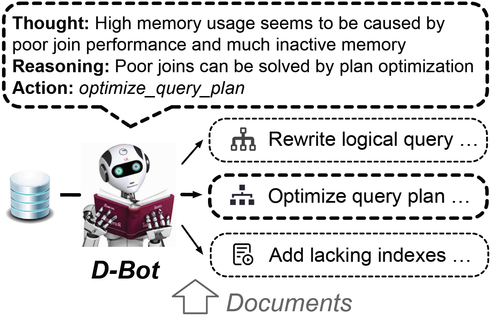

<div align= "center">
    <h1> LLM As Database Administrator</h1>
</div>

<p align="center">
  <a href="#-news">News</a> •
  <a href="#-features">Features</a> •
  <a href="#-quickstart">QuickStart</a> •
  <a href="#-cases">Cases</a> •
  <a href="#-community">Community</a> •  
  <a href="#-projects">Relevant Projects</a>
</p>


<br>
<div align="center">

</div>
<br>


🧗 Database administrators (DBAs) play a crucial role in managing, maintaining and optimizing a database system to ensure data availability, performance, and reliability. However, it is hard and tedious for DBAs to manage a large number of database instances. Thus, we propose *D-Bot*, a LLM-based database administrator that can acquire database maintenance experience from textual sources, and provide **reasonable**, **well-founded**, **in-time** diagnosis and optimization advice for target databases.


<span id="-news"></span>

## What's New
- **[2023/8/10]** Our [**vision paper**](https://arxiv.org/abs/2308.05481) is released.


<span id="-features"></span>

## Features
- **Well-Founded Diagnosis**: D-Bot can provide founded diagnosis by utilizing relevant database knoweledge (with *document2experience*).

- **Practical Tool Utilization**: D-Bot can utilize both monitoring and optimization tools to improve the maintenance capability (with *tool learning* and *tree of thought*).

- **In-depth Reasoning**: Compared with vanilla LLMs, D-Bot will achieve competitive reasoning capability to analyze root causes (with *multi-llm communications*).

<br>
<div align="center">

</div>
<br>


**A demo of using D-Bot**

https://github.com/OpenBMB/AgentVerse/assets/11704492/c633419d-afbb-47d4-bb12-6bb512e7af3a


<span id="-quickstart"></span>

## QuickStart

> Current version is developed from agentverse and bmtools, to which we previously contributed.

<br>
<div align="center">

</div>
<br>

### Prerequisites

- PostgreSQL v12 or higher

    Add database settings into [config.ini](tool_learning/bmtools/bmtools/tools/db_diag/config.ini) and rename into *my_config.ini*:

    ```bash
    [postgresql]
    host = 
    port = 
    user = 
    password = 
    dbname = 
    ```

    > Additionally, install extensions like *[pg_stat_statements](https://pganalyze.com/docs/install/01_enabling_pg_stat_statements)* (track slow queries) and *[pg_hint_plan](https://pg-hint-plan.readthedocs.io/en/latest/installation.html)* (optimize physical operators)

- Prometheus and Grafana ([tutorial](https://grafana.com/docs/grafana/latest/getting-started/get-started-grafana-prometheus/))


### Installation

Step1: Install python packages.

```bash
pip install -r requirements.txt
```

Step2: Configure environment variables.

- Export your OpenAI API key
```bash
# Export your OpenAI API key
export OPENAI_API_KEY="your_api_key_here"
```

- If accessing openai service via vpn, execute this command:
```bash
export https_proxy=http://127.0.0.1:7890 http_proxy=http://127.0.0.1:7890 all_proxy=socks5://127.0.0.1:7890
```

### Preparation

#### Diagnosis Knowledge

- Extract knowledge from both code (./knowledge_json/knowledge_from_code) and documents (./knowledge_json/knowledge_from_document).

    - Add code blocks into [diagnosis_code.txt](./knowledge_json/knowledge_from_code/scripts/diagnosis_code.txt) file -> Rerun the *extract_knowledge.py* script -> Check the update results and sync to [root_causes_dbmind.jsonl](./tool_learning/bmtools/bmtools/tools/db_diag/root_causes_dbmind.jsonl).


#### Tool Usage

- Extract hundreds of tool APIs to carry out different monitoring/optimization functions (./tool_learning/tool_apis).

    - Check the update results and sync to [api.py](./tool_learning/bmtools/bmtools/tools/db_diag/api.py).

- Start bmtools service.

```bash
cd tool_learning/bmtools
python host_local_tools.py
```

- Test tool usage (basic *tree of thought* algorithm within *./tool_learning/tree_of_thought*).

```bash
cd tool_learning/tree_of_thought
python test_database.py
```

### Anomaly Generation & Detection

Within the *anomaly_scripts* directory, we offer scripts that could incur typical anomalies, e.g., 

(1) ./run_benchmark_tpcc.sh or ./run_db_exception.sh

    Example Anomalies: INSERT_LARGE_DATA, IO_CONTENTION

<details><summary><b>monitoring dashboard</b></summary>
<br>
<div align="center">

</div>
<br>
</details>
  
---

(2) ./run_benchmark_job.sh

    Example Anomalies: POOR_JOIN_PERFORMANCE, CPU_CONTENTION


<details><summary><b>monitoring dashboard</b></summary>
<br>
<div align="center">

</div>
<br>
</details>

---

(3) ./run_benchmark_tpch.sh

    Example Anomalies: FETCH_LARGE_DATA (lineitem with 28GB); CORRELATED_SUBQUERY

<details><summary><b>monitoring dashboard</b></summary>
<br>
<div align="center">

</div>
<br>
</details>

### Diagnosis & Optimization

#### Command-line Interface

```shell
python3 main.py --task db_diag
```

#### Website Interface

We also provide a local website demo for this environment. You can launch it with

```shell
python3 main_demo.py --task db_diag
```

After successfully launching the local server, you can visit [http://127.0.0.1:7860/](http://127.0.0.1:7860/) to trigger the diagnosis procedure (click the *Start Autoplay* button).


<span id="-cases"></span>

## Cases

<details><summary><b>xxx</b></summary>

<div align="center">
xxx
</div>

</details>


## Todo

- [ ] Project cleaning
- [ ] (framework update) Integrate components as a whole 
- [ ] Public generated anomaly training data
- [ ] Fine-tune open-source Model
- [ ] Support other databases like *MySQL*
- [ ] Collect more knowledge and store in vector db (./knowledge_vector_db)

> The listed items are **urgent**, which we will fix within this month.

<span id="-community"></span>

## Community

- [Tsinghua University](https://www.tsinghua.edu.cn/en/)
- [ModelBest](https://modelbest.cn/)

<span id="-projects"></span>

## Relevant Projects

https://github.com/OpenBMB/AgentVerse

https://github.com/OpenBMB/BMTools

https://github.com/OpenBMB/ToolBench

<!--## Citation
Feel free to cite us if you like this project.
```bibtex
@misc{zhou2023llm4diag,
      title={LLM As DBA}, 
      author={Xuanhe Zhou, Guoliang Li, Zhiyuan Liu},
      year={2023},
      eprint={xxxx},
      archivePrefix={arXiv},
      primaryClass={xxxx}
}
```-->
