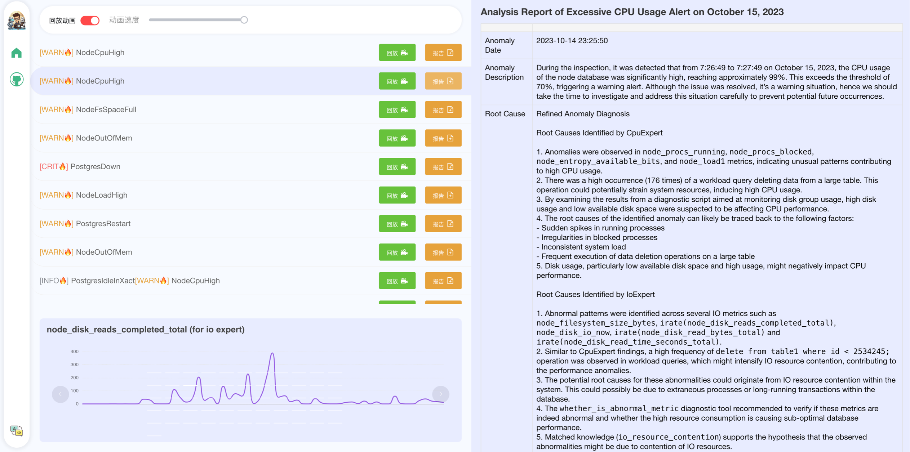
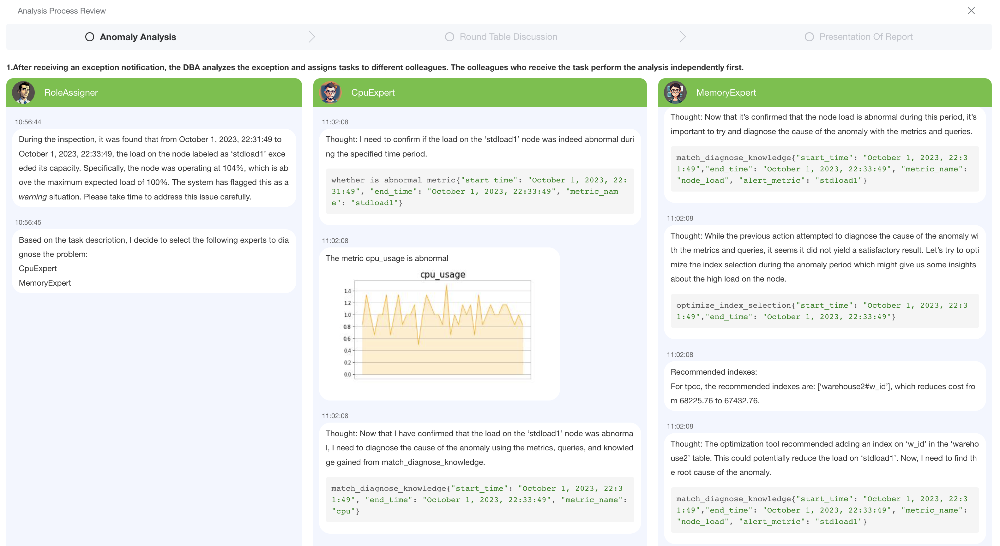

<div align= "center">
    <h1>  LLM As Database Administrator</h1>
</div>

<p align="center">
  <!-- <a href="#-features">Features</a> • -->
  <a href="#-demo">Demo</a> •
  <a href="#-news">Updates</a> •
  <a href="#-quickstart">QuickStart</a> •
  <a href="#-anomalies">Alerts And Anomalies</a> •  
  <a href="#-customize">Knowledge And Tools</a> • 
  <a href="#-FAQ">FAQ</a> •  
  <a href="#-community">Community</a> •  
  <a href="#-contributors">Contributors</a>
</p>

<!-- <p align="center">
    【English | <a href="README-Chinese.md">中文</a>】
</p> -->

🦾 Build your personal database administrator (D-Bot)🧑‍💻, which is good at *reading documents, using various tools, writing analysis reports!* 

<!-- >Besides, to extend the database maintenance capability, we are also finetuning LLMs to support localized diagnosis, *query rewriting* and *anomaly simulation* (comming soon). -->

<p align="center">
    
</p>


<span id="-demo"></span>

## 🗺 Online Demo

In the online website ([http://dbgpt.dbmind.cn](http://dbgpt.dbmind.cn)
), you can browse all the historical diagnosis results, used metrics, and the detailed diagnosis processes.

<p align="center">
  <a href="http://dbgpt.dbmind.cn">
    
  </a>
</p>

<p align="center">
  <a href="http://dbgpt.dbmind.cn">
    
  </a>
</p>

<span id="-news"></span>

## 📰 Updates

- [x] Upgrade the LLM-based diagnosis mechanism: 

    * [x] *Task Dispatching -> Concurrent Diagnosis -> RoundTable Discussion -> Report Generation (downloadable)*

- [x] Add typical anomalies and alerts (Pigsty) <a href="#-anomalies">🔗 link</a>

- [x] An end-to-end framework is available! <a href="#-diagnosis">🚀 link</a>

<!-- - [x] **[2023/8/25]** Support vue-based website interface. More flexible and beautiful! <a href="#-frontend">🔗 link</a> -->

- [ ] Support monitoring and optimization tools in multiple levels [🔗 link](multiagents/tools)

    * [x] Monitoring metrics (Prometheus)
    * [x] Diagnosis knowledge retrieval (dbmind)
    * [x] Logical query transformations (Calcite)
    * [x] Index optimization algorithms (for PostgreSQL)
    * [x] Physical operator hints (for PostgreSQL)
    * [ ] Backup and Point-in-time Recovery (Pigsty)


- [x] Our vision papers are released (continuously update) 

    * *LLM As DBA.* [[paper]](https://arxiv.org/abs/2308.05481) [[中文解读]](https://mp.weixin.qq.com/s/i0-Fdde7DX9YE1jACxB9_Q) [[twitter]](https://twitter.com/omarsar0/status/1689811820272353280?s=61&t=MlkXRcM6bNQYHnTIQVUmVw) [[slides]](materials/slides)

    * *DB-GPT: Large Language Model Meets Database.* [[paper]](http://dbgroup.cs.tsinghua.edu.cn/ligl/papers/dbgpt-dse.pdf)

> This project is evolving with new features 👫👫<br/> 
> Don't forget to star ⭐ and watch 👀 to stay up to date :)


<span id="-quickstart"></span>

## 🕹 QuickStart

### Folder Structure

    .
    ├── multiagents
    │   ├── agent_conf                        # Settings of each agent
    │   ├── agents                            # Implementation of different agent types 
    │   ├── environments                      # E.g., chat orders / chat update / terminal conditions
    │   ├── knowledge                         # Diagnosis experience from documents
    │   ├── llms                              # Supported models
    │   ├── memory                            # The content and summary of chat history
    │   ├── reasoning_algorithms              # The available algorithm for single LLM reasoning
    │   ├── response_formalize_scripts        # Useless content removal of model response
    │   ├── tools                             # External monitoring/optimization tools for models
    │   └── utils                             # Other functions (e.g., database/json/yaml operations)
    ├── web_service                           # Web services to view diagnostic reports
    │   ├── backend                           # Web services backend
    │   ├── frontend                          # Web services frontend 
    ├── webhook                               # Use the webhook to save the results of the alert to a file


<span id="-frontend"></span>

### Website Side

We provide a local website to browse historical diagnosis reports and procedures. You can easily launch it with

* install dependencies for the first run。

```
# install frontend environment
cd web_service/frontend
rm -rf node_modules/
rm -r package-lock.json
# install dependencies for the first run (nodejs, ^16.13.1 is recommended)
npm install  --legacy-peer-deps
```

* run

```shell
# cd service directory
cd web_service
# launch the local server and open the website
sh run_service.sh
```

> Modify the "python app.py" command within *run_demo.sh* if multiple versions of Python are installed.

After successfully launching the local server, visit [http://127.0.0.1:8025/](http://127.0.0.1:8025/) to browse the diagnosis reports.

### Anomaly Diagnosis

<span id="-prerequisites"></span>

#### 1. Prerequisites

- PostgreSQL v12 or higher

    > Make sure your database supports remote connection ([link](https://support.cpanel.net/hc/en-us/articles/4419265023383-How-to-enable-remote-PostgreSQL-access))

    > Additionally, install extensions like *[pg_stat_statements](https://pganalyze.com/docs/install/01_enabling_pg_stat_statements)* (track frequent queries), *[pg_hint_plan](https://pg-hint-plan.readthedocs.io/en/latest/installation.html)* (optimize physical operators), and *[hypopg](https://github.com/HypoPG/hypopg)* (create hypothetical Indexes).

    > Note *pg_stat_statements* continuosly accumulate query statistics over time. So you need to clear the statistics from time to time: 1) To discard all the statistics, execute *"SELECT pg_stat_statements_reset();"*; 2) To discard the statistics of specific query, execute *"SELECT pg_stat_statements_reset(userid, dbid, queryid);"*.

- Enable slow query log in PostgreSQL ([link](https://ubiq.co/database-blog/how-to-enable-slow-query-log-in-postgresql/))

    > (1) For *"systemctl restart postgresql"*, the service name can be different (e.g., postgresql-12.service); 
    
    > (2) Use absolute log path name like *"log_directory = '/var/lib/pgsql/12/data/log'"*; 
    
    > (3) Set *"log_line_prefix = '%m [%p] [%d]'"* in postgresql.conf (to record the database names of different queries).

- Prometheus

    > Check [prometheus.md](materials/help_documents/prometheus.md) for detailed installation guides.


#### 2. Package Installation

Step 1: Install python packages.

```bash
pip install -r requirements.txt
```

Step 2: Configure environment variables.

- Export your OpenAI API key
```bash
# macos
export OPENAI_API_KEY="your_api_key_here"
```

```bash
# windows
set OPENAI_API_KEY="your_api_key_here"
```

Step 3: Add database/anomaly/prometheus settings into [tool_config_example.yaml](config/tool_config_example.yaml) and rename into *tool_config.yaml*:

    ```bash
    POSTGRESQL:
      host: 182.92.xxx.x
      port: 5432
      user: xxxx
      password: xxxxx
      dbname: postgres

    DATABASESERVER:
      server_address: 182.92.xxx.x
      username: root
      password: xxxxx
      remote_directory: /var/lib/pgsql/12/data/log

    PROMETHEUS:
      api_url: http://8.131.xxx.xx:9090/
      postgresql_exporter_instance: 172.27.xx.xx:9187
      node_exporter_instance: 172.27.xx.xx:9100
    ```

> *remote_directory* in the DATABASESERVER setting indicates where the slow query log file is located at (<a href="#-prerequisites">link</a>).


- If accessing openai service via vpn, execute this command:
```bash
# macos
export https_proxy=http://127.0.0.1:7890 http_proxy=http://127.0.0.1:7890 all_proxy=socks5://127.0.0.1:7890
```

- Test your openai key
```bash
cd others
python openai_test.py
```

#### Diagnosis

- Test single case

```shell
python main.py
```

- Test in batch

```shell
python batch_main.py
```

<span id="-anomalies"></span>

## 🎩 Alerts And Anomalies

### Alert Management

We support AlertManager for Prometheus. You can find more information about how to configure alertmanager here: [alertmanager.md](https://prometheus.io/docs/alerting/latest/configuration/).

- We provide AlertManager-related configuration files, including [alertmanager.yml](./config/alertmanager.yml), [node_rules.yml](./config/node_rules.yml), and [pgsql_rules.yml](./config/pgsql_rules.yml). The path is in the [config folder](./config/) in the root directory, which you can deploy to your Prometheus server to retrieve the associated exceptions.
- We also provide webhook server that supports getting alerts. The path is a webhook folder in the root directory that you can deploy to your server to get and store Prometheus's alerts. The diagnostic model periodically grabs Alert information from this server. This file is obtained using SSh. You need to configure your server information in the [tool_config.yaml](./config/tool_config_example.yaml) in the config folder.
- [node_rules.yml](./config/node_rules.yml) and [pgsql_rules.yml](./config/pgsql_rules.yml) is a reference https://github.com/Vonng/pigsty code in this open source project, their monitoring do very well, thank them for their effort.


### Anomaly Simulation

#### Manually Designed Anomalies

*[Click to check 29 typical anomalies together with expert analysis](./anomaly_trigger/29种性能异常与根因分析.pdf) (supported by the DBMind team)*

#### Script-Triggered Anomalies

Within the *[anomaly_trigger](./anomaly_trigger)* directory, we aim to offer scripts that could incur typical anomalies, e.g., 

| Root Cause          | Description                                           | Case                 |
|---------------------|-------------------------------------------------------|----------------------|
|     | Long execution time for large data insertions         |                      |
|     | Long execution time for large data fetching           |                      |
|      | Missing indexes causing performance issues            |   [🔗 link](case_analysis/missing_indexes.txt)     |
|       | Unnecessary and redundant indexes in tables           |                      |
|               |       Unused space caused by data modifications       |                      |
|  | Poor performance of Join operators                  |                      |
|  | Non-promotable subqueries in SQL                      |                      |
|  | Outdated statistical info affecting execution plan    |                      |
|      | Lock contention issues                                |                      |
|       | Severe external CPU resource contention               |                      |
|        | IO resource contention affecting SQL performance      |                      |
|  | High-concurrency inserts affecting SQL execution        |   [🔗 link](case_analysis/concurrent_inserts.txt)     |
|  | High-concurrency commits affecting SQL execution        |   [🔗 link](case_analysis/concurrent_commits.txt)     |
|  | Workload concentration affecting SQL execution        |   [🔗 link](case_analysis/workload_contention.txt)     |
|     | Tool small allocated memory space              |                      |
|      | Reach the max I/O capacity or  throughput               |                      |


<span id="-customize"></span>

## 📎 Customize Knowledge And Tools

<span id="-doc2knowledge"></span>

### 1. Knowledge Extraction (Document)

Step 1. Rename *doc2knowledge/config_template.json* into *doc2knowledge/config.json*. And add the value for "api_key" ("organization" is optional)

> GPT-4 is necessary to utilize the *function calling* feature. I will try to solve this limit.

Step 2. Split documents into separated section files by the section indexes (e.g., section1, section1.1, section2 ...). And copy the section files into the *docs/<your_document_name>/raw/*. For example:

    .
    ├── docs
    │   ├── report_example
    |   │   ├── raw    
    |   │   |    ├── 1 title.txt    
    |   │   |    ├── 1.1 category.txt

> It is a laborious work and hard to find a better way than manually splitting the given document

> You can jump over this step and directly run the *report_example* case

Step 3. Modify the arguments in *doc2knowledge.py* script and run the script:

```bash
python doc2knowledge.py
```

> The summary for the same document sections is cached. You can delete this file if do not like to reuse the previous caches.


<span id="-tools"></span>

### 2. Tool Preparation

- Tool APIs (for optimization)

    | Module                  | Functions |
    |-------------------------|-----------|
    | [index_selection](multiagents/tools/index_advisor) (equipped)          | *heuristic* algorithm  |
    | [query_rewrite](multiagents/tools/query_advisor) (equipped)           | *45* rules  |
    | [physical_hint](multiagents/tools/query_advisor) (equipped)           | *15* parameters  |

    For functions within [[query_rewrite](multiagents/tools/query_advisor), [physical_hint](multiagents/tools/query_advisor)], you can use *api_test.py* script to verify the effectiveness. 

    If the function actually works, append it to the *api.py* of corresponding module.

<span id="-tot"></span>

- Tool Usage Algorithm (*tree of thought*)

    ```bash
    cd tree_of_thought
    python test_database.py
    ```

    > History messages may take up many tokens, and so carefully decide the *turn number*.


<span id="-FAQ"></span>

## 💁 FAQ

<details><summary><b>🤨 The '.sh' script command cannot be executed on windows system.</b></summary>
Switch the shell to *git bash* or use *git bash* to execute the '.sh' script.
</details>

<details><summary><b>🤨 "No module named 'xxx'" on windows system.</b></summary>
This error is caused by issues with the Python runtime environment path. You need to perform the following steps:

Step 1: Check Environment Variables.

<div align="center">

</div>

You must configure the "Scripts" in the environment variables.

Step 2: Check IDE Settings.

For VS Code, download the Python extension for code. For PyCharm, specify the Python version for the current project.
</details>


## ⏱ Todo

- ~~Project cleaning~~
- ~~Support more anomalies~~
- Strictly constrain the llm outputs (excessive irrelevant information) based on the matched knowledge 
- ~~Query log option (potential to take up disk space and we need to consider it carefully)~~
- ~~Add more communication mechanisms~~
- ~~Support more knowledge sources~~
- Localized model that reaches D-bot(gpt4)'s capability
- Support other databases (e.g., mysql/redis)


<span id="-community"></span>

## 👫 Community

- [Tsinghua University](https://www.tsinghua.edu.cn/en/)
- [ModelBest](https://modelbest.cn/)


<span id="-projects"></span>

## Relevant Projects

https://github.com/OpenBMB/AgentVerse

https://github.com/Vonng/pigsty


<span id="-citation"></span>

## Citation
Feel free to cite us if you like this project.
```bibtex
@misc{zhou2023llm4diag,
      title={LLM As DBA}, 
      author={Xuanhe Zhou, Guoliang Li, Zhiyuan Liu},
      year={2023},
      eprint={2308.05481},
      archivePrefix={arXiv},
      primaryClass={cs.DB}
}
```

```bibtex
@misc{zhou2023dbgpt,
      title={DB-GPT: Large Language Model Meets Database}, 
      author={Xuanhe Zhou, Zhaoyan Sun, Guoliang Li},
      year={2023},
      archivePrefix={Data Science and Engineering},
}
```

<span id="-contributors"></span>

## 📧 Contributors

<!-- Copy-paste in your Readme.md file -->

<a href="https://github.com/TsinghuaDatabaseGroup/DB-GPT/network/dependencies">
  
</a>

Other Collaborators: [Wei Zhou](https://github.com/Beliefuture), [Kunyi Li](https://github.com/LikyThu).

We thank all the contributors to this project. Do not hesitate if you would like to get involved or contribute!