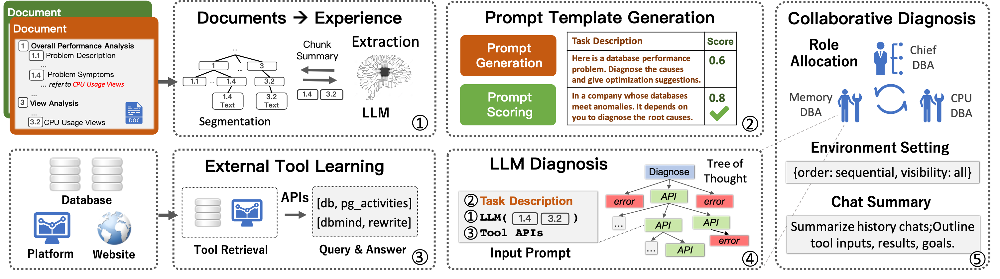
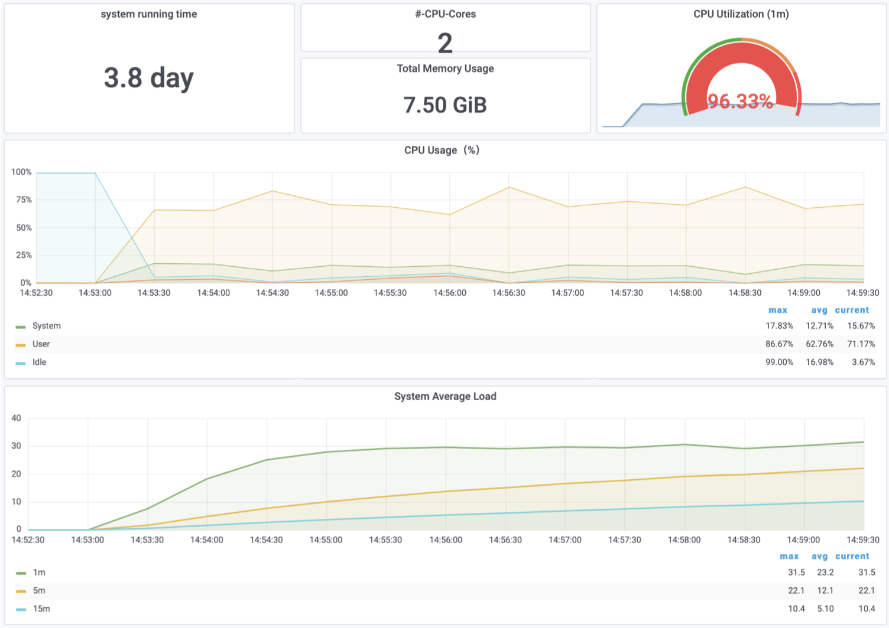
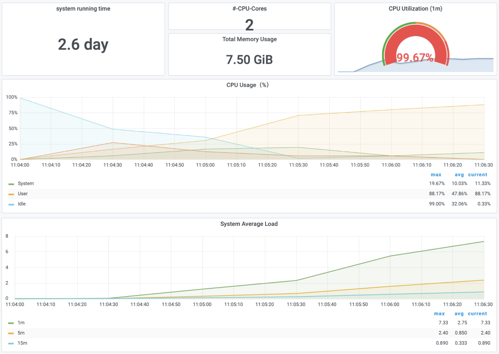
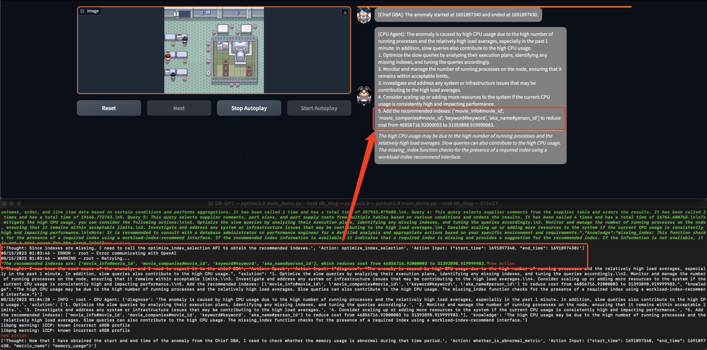
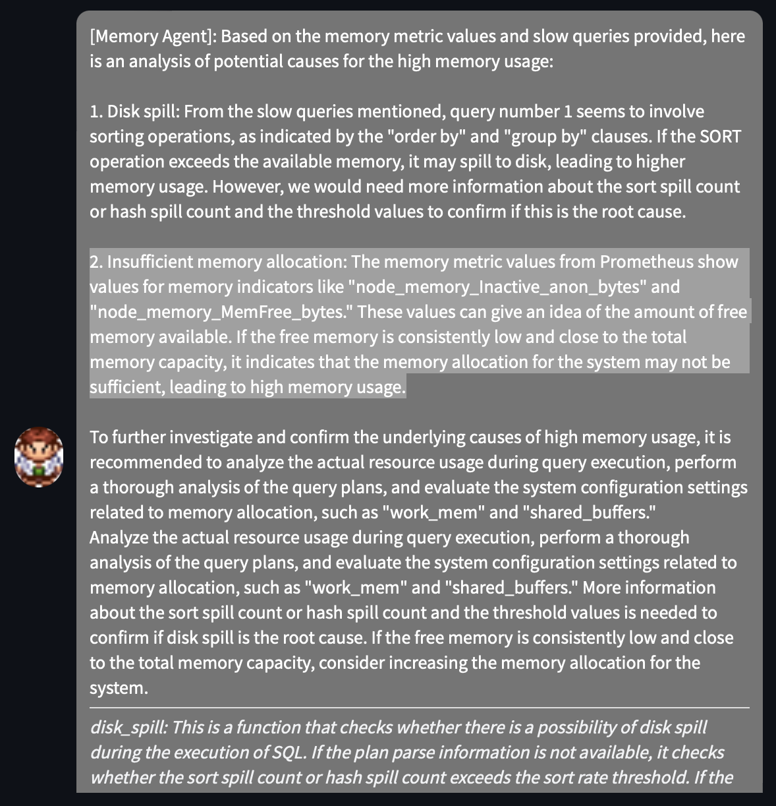

<div align= "center">
    <h1> LLM As Database Administrator</h1>
</div>

<p align="center">
  <a href="#-news">News</a> •
  <a href="#-features">Features</a> •
  <a href="#-quickstart">QuickStart</a> •
  <a href="#-cases">Cases</a> •
  <a href="#-community">Community</a> •  
  <a href="#-contributors">Contributors</a>
</p>


<br>
<div align="center">

</div>
<br>


🧗 Database administrators (DBAs) play a crucial role in managing, maintaining and optimizing a database system to ensure data availability, performance, and reliability. However, it is hard and tedious for DBAs to manage a large number of database instances. Thus, we propose *DBAgent*, a LLM-based database administrator that can acquire database maintenance experience from textual sources, and provide **reasonable**, **well-founded**, **in-time** diagnosis and optimization advice for target databases.


<span id="-news"></span>

## What's New
- **[2023/8/16]** Support multi-level <a href="#-tools">optimization functions</a>.

- **[2023/8/15]** Initialize <a href="#-solid_response">solid response</a> mechanism.

- **[2023/8/10]** Our [**vision paper**](https://arxiv.org/abs/2308.05481) is released ([中文解读](https://mp.weixin.qq.com/s/i0-Fdde7DX9YE1jACxB9_Q)).


<span id="-features"></span>

## Features
- **Well-Founded Diagnosis**: DBAgent can provide founded diagnosis by utilizing relevant database knowledge (with *document2experience*).

- **Practical Tool Utilization**: DBAgent can utilize both monitoring and optimization tools to improve the maintenance capability (with *tool learning* and *tree of thought*).

- **In-depth Reasoning**: Compared with vanilla LLMs, DBAgent will achieve competitive reasoning capability to analyze root causes (with *multi-llm communications*).

<br>
<div align="center">

</div>
<br>


**A demo of using DBAgent**

https://github.com/OpenBMB/AgentVerse/assets/11704492/c633419d-afbb-47d4-bb12-6bb512e7af3a


<span id="-quickstart"></span>

## QuickStart

> Current version is developed from agentverse and bmtools, to which we previously contributed.

<br>
<div align="center">

</div>
<br>

### Prerequisites

- PostgreSQL v12 or higher

    Add database settings into [config.ini](tool_learning/bmtools/tools/config.ini) and rename into *my_config.ini*:

    ```bash
    [postgresql]
    host = xxx.xxx.xxx.xxx
    port = 5432
    user = xxx
    password = xxx
    dbname = postgres
    ```

    > Additionally, install extensions like *[pg_stat_statements](https://pganalyze.com/docs/install/01_enabling_pg_stat_statements)* (track slow queries), *[pg_hint_plan](https://pg-hint-plan.readthedocs.io/en/latest/installation.html)* (optimize physical operators), and *[hypopg](https://github.com/HypoPG/hypopg)* (create hypothetical Indexes).

- Prometheus and Grafana ([tutorial](https://grafana.com/docs/grafana/latest/getting-started/get-started-grafana-prometheus/))


### Package Installation

Step1: Install python packages.

```bash
pip install -r requirements.txt
```

Step2: Configure environment variables.

- Export your OpenAI API key
```bash
# Export your OpenAI API key
export OPENAI_API_KEY="your_api_key_here"
```

- If accessing openai service via vpn, execute this command:
```bash
export https_proxy=http://127.0.0.1:7890 http_proxy=http://127.0.0.1:7890 all_proxy=socks5://127.0.0.1:7890
```

### Anomaly Generation & Detection

Within the *anomaly_scripts* directory, we offer scripts that could incur typical anomalies, e.g., 

(1) ./run_benchmark_tpcc.sh or ./run_db_exception.sh

    Example Anomalies: INSERT_LARGE_DATA, IO_CONTENTION

<details><summary><b>monitoring dashboard</b></summary>
<br>
<div align="center">

</div>
<br>
</details>
  
---

(2) ./run_benchmark_job.sh

    Example Anomalies: POOR_JOIN_PERFORMANCE, CPU_CONTENTION


<details><summary><b>monitoring dashboard</b></summary>
<br>
<div align="center">

</div>
<br>
</details>

---

(3) ./run_benchmark_tpch.sh

    Example Anomalies: FETCH_LARGE_DATA (lineitem with 28GB); CORRELATED_SUBQUERY

<details><summary><b>monitoring dashboard</b></summary>
<br>
<div align="center">

</div>
<br>
</details>

### Set Up Tool Service

Start bmtools service (kept alive for <a href="#-diagnosis">*diagnosis*</a> and <a href="#-tot">*tree of thought*</a>).

```bash
cd tool_learning
python host_local_tools.py
```

<span id="-diagnosis"></span>


<span id="-diagnosis"></span>

### Diagnosis & Optimization

#### Command-line Interface

```shell
python main.py --task db_diag
```

#### Website Interface

We also provide a local website demo for this environment. You can launch it with

```shell
python main_demo.py --task db_diag
```

After successfully launching the local server, you can visit [http://127.0.0.1:7860/](http://127.0.0.1:7860/) to trigger the diagnosis procedure (click the *Start Autoplay* button).


### Preparation (optional)

#### Knowledge Preparation

- Extract knowledge from both code (./knowledge_json/knowledge_from_code) and documents (./knowledge_json/knowledge_from_document).

    - Add code blocks into [diagnosis_code.txt](./knowledge_json/knowledge_from_code/scripts/diagnosis_code.txt) file -> Rerun the *extract_knowledge.py* script -> Check the update results and sync to [root_causes_dbmind.jsonl](./tool_learning/bmtools/tools/db_diag/root_causes_dbmind.jsonl).


<span id="-tools"></span>

#### Tool Preparation

- Tool APIs (for optimization)

    | Module                  | Functions |
    |-------------------------|-----------|
    | [index_selection](./tool_learning/bmtools/tools/db_diag/optimization_tools/index_selection) (equipped)          | *heuristic* algorithm  |
    | [query_rewrite](./tool_learning/bmtools/tools/db_diag/optimization_tools/query_rewrite)           | *45* rules  |
    | [physical_hint](./tool_learning/bmtools/tools/db_diag/optimization_tools/physical_operator_hint)           | *15* parameters  |

    For functions within [[query_rewrite](./tool_learning/bmtools/tools/db_diag/optimization_tools/query_rewrite), [physical_hint](./tool_learning/bmtools/tools/db_diag/optimization_tools/physical_operator_hint)], you can use *api_test.py* script to verify the effectiveness. 

    If the function actually works, append it to [api.py](./tool_learning/bmtools/tools/db_diag/api.py).

<span id="-tot"></span>

- Tool Usage Algorithm (*tree of thought*)

    Step1: Remove the comment of 18th code line in [host_local_tools.py](tool_learning/host_local_tools.py).

    ```python
    load_database_tool()
    ```

    Step2: Reset up the bmtools service.

    ```bash
    cd tool_learning
    python host_local_tools.py
    ```

    Step3: Run the test script.

    ```bash
    cd tool_learning/tree_of_thought
    python test_database.py
    ```

    > History messages may take up many tokens, and so carefully decide the *turn number*.


### Prompt Template Generation (optional)

Derive *high-quality prompt templates* from a small number of collected samples (splitting into training and evaluation sets), e.g.,

1. Prompts for index tuning optimization

```bash
cd prompt_template_scripts/index_tuning
./run.sh
```

2. Prompts for query rewrite optimization

```bash
cd prompt_template_scripts/query_rewrite
./run.sh
```

<span id="-solid_response"></span>

### Mechanisms for Solid Responses

#### Remove redundant content in llm responses 

```python 
python ./response_formalize_scripts/combine_similar_answer.py # test 
```


<details><summary><b>Before Cleaning</b></summary>

```vim
[Chief DBA]: The identified root causes of the anomaly are high CPU usage due to the high number of running processes and high load averages, slow queries, and high memory usage due to complex queries, insufficient memory allocation, and the possibility of disk spill.
Optimize the slow queries by analyzing their execution plans, identifying any missing indexes, and tuning the queries accordingly
Polisih the slow queries by checking their execution plans, identifying any missing indexes, and tuning the queries accordingly
Monitor and manage the number of running processes on the node, ensuring that it remains within acceptable limits
Investigate and address any system or infrastructure issues that may be contributing to the high load averages
Consider scaling up or adding more resources to the system if the current CPU usage is consistently high and impacting performance
Add the recommended indexes: ['movie_info#movie_id', 'movie_companies#movie_id', 'keyword#keyword', 'aka_name#person_id'] to reduce cost
Further investigate and optimize the slow queries for better memory utilization
Monitor and adjust the memory allocation parameters like 'work_mem' and 'shared_buffers' to optimize memory usage
Analyze the query plans and consider adjustments to parameters like 'work_mem' and 'shared_buffers' to help reduce or eliminate disk spilling
```
</details>

<details><summary><b>After Cleaning</b></summary>

```vim
[Chief DBA]: The identified root causes of the anomaly are high CPU usage due to the high number of running processes and high load averages, slow queries, and high memory usage due to complex queries, insufficient memory allocation, and the possibility of disk spill.
Polisih the slow queries by checking their execution plans, identifying any missing indexes, and tuning the queries accordingly.
Monitor and manage the number of running processes on the node, ensuring that it remains within acceptable limits.
Add the recommended indexes: ['movie_info#movie_id', 'movie_companies#movie_id', 'keyword#keyword', 'aka_name#person_id'] to reduce cost.
```
</details>


<span id="-cases"></span>

## Cases

<details><summary><b>MISSING_INDEXES → INDEX_SELECTION</b></summary>

<br>
<div align="center">

</div>
<br>

Note *optimize_index_selection* takes minutes to explore beneficial index combinations.

```vim
[Chief DBA]: The anomaly started at 1691897340 and ended at 1691897430.

[CPU Agent]: The anomaly is caused by high CPU usage due to the high number of running processes and the relatively high load averages, especially in the past 1 minute. In addition, slow queries also contribute to the high CPU usage.
1. Optimize the slow queries by analyzing their execution plans, identifying any missing indexes, and tuning the queries accordingly.
2. Monitor and manage the number of running processes on the node, ensuring that it remains within acceptable limits.
3. Investigate and address any system or infrastructure issues that may be contributing to the high load averages.
4. Consider scaling up or adding more resources to the system if the current CPU usage is consistently high and impacting performance.
5. Add the recommended indexes: ['movie_info#movie_id', 'movie_companies#movie_id', 'keyword#keyword', 'aka_name#person_id'] to reduce cost from 46856716.92000003 to 31393898.919999983.
----------------------------
(matched knowledge) The high CPU usage may be due to the high number of running processes and the relatively high load averages. Slow queries can also contribute to the high CPU usage. The missing_index function checks for the presence of a required index using a workload-index-recommend interface.

[Memory Agent]: The potential causes of high memory usage could be complex queries, insufficient memory allocation, and possibility of disk spill. The slow queries mentioned involve complex operations such as filtering, grouping, and joining multiple tables, which can consume a significant amount of memory, especially if they involve large data sets. The abnormal memory metric values suggest that the available memory might be insufficient to handle the workload. Adjusting parameters like 'work_mem' and 'shared_buffers' might help alleviate memory issues. The complexity and size of the slow queries could potentially lead to disk spill during execution, which can significantly impact performance.
1. Further investigate and optimize the slow queries mentioned above for better memory utilization.
2. Monitor and adjust the memory allocation parameters like 'work_mem' and 'shared_buffers' to optimize memory usage.
3. Analyze the query plans and consider adjustments to parameters like 'work_mem' and 'shared_buffers' to help reduce or eliminate disk spilling.
----------------------------
(matched knowledge) Disk spill is a function that checks whether there is a possibility of disk spill during the execution of SQL. If the plan parse information is not available, it checks whether the sort spill count or hash spill count exceeds the sort rate threshold. If the plan parse information is available, it calculates the total cost of the plan and checks whether the cost rate of the sort or hash operators exceeds the cost rate threshold. If abnormal operator details are found and the sort or hash spill count is greater than 0, it indicates that the SORT/HASH operation may spill to disk. The suggestion is to analyze whether the business needs to adjust parameters like work_mem and shared_buffers. If disk spill is detected, it is a root cause, otherwise it is not a root cause.

[Chief DBA]: The identified root causes of the anomaly are high CPU usage due to the high number of running processes and high load averages, slow queries, and high memory usage due to complex queries, insufficient memory allocation, and the possibility of disk spill.
----------------------------
(solution) 1. Monitor and manage the number of running processes on the node, ensuring that it remains within acceptable limits.
2. Add the recommended indexes: ['movie_info#movie_id', 'movie_companies#movie_id', 'keyword#keyword', 'aka_name#person_id'] to reduce cost.
3. Analyze the query plans and consider adjustments to parameters like 'work_mem' and 'shared_buffers' to help reduce or eliminate disk spilling.
4. Investigate and address any system or infrastructure issues that may be contributing to the high load averages.
```

</details>


<details><summary><b>INSUFFICIENT_MEMORY_ALLOCATION</b></summary>
<br>
<div align="center">

</div>
<br>

```vim
[Chief DBA]: The anomaly started at 1691897340 and ended at 1691897430.

[CPU Agent]: Based on the CPU relevant metric values, the root cause of high CPU usage could be a high load value, too many active processes, blocked processes, high CPU scrape collector duration, and low entropy.
I suggest reviewing system logs and identifying any recent changes or updates. We should also analyze other relevant metrics such as memory usage, disk I/O, network traffic, and check for any abnormal behavior from specific processes or applications.
----------------------------
(matched knowledge) missing_index: This function checks for the presence of a required index using a workload-index-recommend interface. If the recommended index information is available, it indicates that a required index is missing and provides a suggestion for the recommended index. If the information is not available, it is not a root cause for the issue.

[Memory Agent]: The root cause of the high memory usage could be disk spill and insufficient memory allocation.
I suggest analyzing the actual resource usage during query execution, performing a thorough analysis of the query plans, and evaluating the system configuration settings related to memory allocation, such as 'work_mem' and 'shared_buffers.' More information about the sort spill count or hash spill count and the threshold values is needed to confirm if disk spill is the root cause. If the free memory is consistently low and close to the total memory capacity, consider increasing the memory allocation for the system.
----------------------------
(matched knowledge) disk_spill: This function checks whether there is a possibility of disk spill during the execution of SQL. If the plan parse information is not available, it checks whether the sort spill count or hash spill count exceeds the sort rate threshold. If the plan parse information is available, it calculates the total cost of the plan and checks whether the cost rate of the sort or hash operators exceeds the cost rate threshold. If abnormal operator details are found and the sort or hash spill count is greater than 0, it indicates that the SORT/HASH operation may spill.

[Chief DBA]: The identified root causes of the anomaly are high CPU usage due to high load value, too many active processes, blocked processes, high CPU scrape collector duration, and low entropy. The high memory usage could be due to disk spill and insufficient memory allocation.
----------------------------
(solution) To resolve the high CPU usage, we should review system logs and identify any recent changes or updates. We should also analyze other relevant metrics such as memory usage, disk I/O, network traffic, and check for any abnormal behavior from specific processes or applications.
To mitigate the high memory usage, we should analyze the actual resource usage during query execution, perform a thorough analysis of the query plans, and evaluate the system configuration settings related to memory allocation, such as 'work_mem' and 'shared_buffers.' More information about the sort spill count or hash spill count and the threshold values is needed to confirm if disk spill is the root cause. If the free memory is consistently low and close to the total memory capacity, consider increasing the memory allocation for the system.
```

</details>


<details><summary><b>POOR_JOIN_PERFORMANCE</b></summary>

https://github.com/TsinghuaDatabaseGroup/DB-GPT/assets/17394639/5a9a91bf-fc1f-415e-8a59-ec8ab5a705df

</details>


## Todo

- [ ] Change to vue frontend
- [ ] More powerful anomaly trigger
- [ ] Project cleaning
- [ ] (framework update) Integrate components as a whole 
- [ ] Public generated anomaly training data
- [ ] Fine-tune open-source Model
- [ ] Support other databases like *MySQL*
- [ ] Collect more knowledge and store in vector db (./knowledge_vector_db)

> The listed items are **urgent**, which we will fix within this month.

<span id="-community"></span>

## Community

- [Tsinghua University](https://www.tsinghua.edu.cn/en/)
- [ModelBest](https://modelbest.cn/)

<span id="-projects"></span>

## Relevant Projects

https://github.com/OpenBMB/AgentVerse

https://github.com/OpenBMB/BMTools

https://github.com/OpenBMB/ToolBench

<span id="-citation"></span>

## Citation
Feel free to cite us if you like this project.
```bibtex
@misc{zhou2023llm4diag,
      title={LLM As DBA}, 
      author={Xuanhe Zhou, Guoliang Li, Zhiyuan Liu},
      year={2023},
      eprint={2308.05481},
      archivePrefix={arXiv},
      primaryClass={cs.DB}
}
```


<span id="-contributors"></span>

## Contributors

<!-- Copy-paste in your Readme.md file -->

<a href="https://github.com/TsinghuaDatabaseGroup/DB-GPT/network/dependencies">
  
</a>

Collaborators not previously mentioned: [Wei Zhou](https://github.com/Beliefuture), [Kunyi Li](https://github.com/LikyThu).

We thank all the contributors to this project. Do not hesitate if you would like to get involved or contribute!
