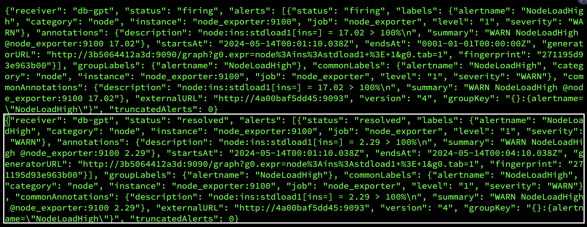

<div align= "center">
    <h1>  LLM As Database Administrator</h1>
</div>

<!-- <p align="center">
    <a href="https://github.com/TsinghuaDatabaseGroup/DB-GPT/blob/main/LICENSE">
        
    </a>
    <a href="https://github.com/OpenBMB/AgentVerse/blob/main/LICENSE">
        
    </a>
</p> -->

<div align="center">

<a href="https://github.com/TsinghuaDatabaseGroup/DB-GPT/tree/main/diagnostic_files/public_testing_set/all_anomalies.jsonl"></a>
<a href="https://github.com/TsinghuaDatabaseGroup/DB-GPT/tree/main/multiagents/tools"></a>
<a href="https://github.com/TsinghuaDatabaseGroup/DB-GPT/tree/main/multiagents/localized_llms/training_data"></a>
<a href="https://cloud.tsinghua.edu.cn/f/6e8a3ad547204303a5ae/?dl=1"></a>
<a href="https://github.com/TsinghuaDatabaseGroup/DB-GPT/tree/main/multiagents/llms"></a>

</div>

<!-- <div align="center">
  <a href="https://github.com/TsinghuaDatabaseGroup/DB-GPT/tree/main/localized_llms">
    <em style="color: red;">DiagLLM</em> 
  </a> 🔥
</div> -->

<p align="center">
  <!-- <a href="#-features">Features</a> • -->
  <a href="#-demo">Demo</a> •
  <a href="#-quickstart">QuickStart</a> •
  <a href="#-anomalies">Alerts And Anomalies</a> •  
  <a href="#-customize">Knowledge And Tools</a> • 
   <a href="#-docker">Dockers</a> •  
  <a href="#-FAQ">FAQ</a> •  
  <a href="#-community">Community</a> •  
  <a href="#-citation">Citation</a> •    
  <a href="#-contributors">Contributors</a> •   
  <a href="https://aihomea.com">OpenAI, Azure aggregated API discounted access plan.</a>
</p>

<p align="center">
<a href="#-contact">👫 Join Us on WeChat!</a> <bar> <a href="https://www.benchcouncil.org/evaluation/opencs/annual.html#Achievements">🏆 Top 100 Open Project!</a> <bar> <a href="#-citation">🌟 VLDB 2024!</a> 
</p>

<p align="center">
    【English | <a href="README_Chinese.md">中文</a>】
</p>


<p align="center">
    
</p>

🦾 Build your personal database administrator (D-Bot)🧑‍💻, which is good at solving database problems by  *reading documents, using various tools, writing analysis reports!*  <a href="#-news">*Undergoing An Upgrade!*</a>


<!-- **An important, major [version update](https://github.com/TsinghuaDatabaseGroup/DB-GPT/tree/chatchat) is coming soon, stay tuned!** 📣 🔜 -->


<!-- >Besides, to extend the database maintenance capability, we are also finetuning LLMs to support localized diagnosis, *query rewriting* and *anomaly simulation* (comming soon). -->


<span id="-demo"></span>

## 🗺 Online Demo

1. After launching the local service (adopting frontend and configs from [Chatchat](chat.openai.com)), you can easily import documents into the knowledge base, utilize the knowledge base for *well-founded Q&A* and *diagnosis analysis of abnormal alarms*.

<!-- <p align="center">
  <a href="http://dbgpt.dbmind.cn">
    
  </a>
</p> -->

[](https://vimeo.com/905172621?share=copy)

2. With the user feedback function [🔗](multiagents/agent_conf/config_feedback.yaml), you can (1) send feedbacks to make D-Bot follow and refine the intermediate diagnosis results, and (2) edit the diagnosis result by clicking the “Edit” button. *D-Bot can accumulate refinement patterns from the user feedbacks (stored in vector database) and adaptively align to user's diagnosis preference.*

<!-- extracted and stored refinement patterns from the feedbacks, with which D-Bot can adapt its performance by RAG techniques. -->

<p align="center">
  
</p>


3. On the online website (http://dbgpt.dbmind.cn), you can browse all historical diagnosis results, used metrics, and detailed diagnosis processes.

<p align="center">
  <a href="http://dbgpt.dbmind.cn">
    
  </a>
</p>


*Old Version 1*: [[Gradio for Diag Game]](https://github.com/TsinghuaDatabaseGroup/DB-GPT/tree/old_version) (no langchain)

*Old Version 2*: [[Vue for Report Replay]](https://github.com/TsinghuaDatabaseGroup/DB-GPT/tree/report_replay) (no langchain)


<span id="-news"></span>

## 📰 Updates

- [ ] Docker for a quick and safe use of D-Bot

    * [x] Metric Monitoring (prometheus), Database (postgres_db), Alert (alertmanager) and Alert Recording (python_app).

    * [ ] D-bot (still too large, with over 12GB)

- [ ] Human Feedback 🔥🔥🔥

    * [x] Test-based Diagnosis Refinement with User Feedbacks

    * [x] Refinement Patterns Extraction & Management

- [ ] Language Support (english / chinese)
    * [x] english : default
    * [x] chinese : add "language: zh" in config.yaml

- [ ] New Frontend

    * [x] Knowledgebase + Chat Q&A + Diagnosis + Report Replay

- [x] Result Report with reference

- [ ] Extreme Speed Version for localized llms

    * [x] [*4-bit* quantized LLM](https://huggingface.co/curtis-sun/diag-baichuan2-4bit/tree/main) (reducing inference time by 1/3)

    * [x] [vllm for fast inference](https://github.com/vllm-project/vllm) (qwen)

    * [ ] Tiny LLM

- [x] Multi-path extraction of document knowledge

    * [x] Vector database (ChromaDB)

    * [x] RESTful Search Engine (Elasticsearch)

- [x] Expert prompt generation using *document knowledge*

- [ ] Upgrade the LLM-based diagnosis mechanism: 

    * [x] *Task Dispatching -> Concurrent Diagnosis -> Cross Review -> Report Generation*

    * [ ] *Synchronous Concurrency Mechanism* during LLM inference


<!-- - [x] An end-to-end framework is available! <a href="#-diagnosis">🚀 link</a> -->

<!-- - [x] **[2023/8/25]** Support vue-based website interface. More flexible and beautiful! <a href="#-frontend">🔗 link</a> -->

- [ ] Support monitoring and optimization tools in multiple levels [🔗 link](multiagents/tools)

    * [x] Monitoring metrics (Prometheus)
    * [ ] Flame graph in code level
    * [x] Diagnosis knowledge retrieval (dbmind)
    * [x] Logical query transformations (Calcite)
    * [x] Index optimization algorithms (for PostgreSQL)
    * [x] Physical operator hints (for PostgreSQL)
    * [ ] Backup and Point-in-time Recovery (Pigsty)


- [x] Papers and experimental reports are continuously updated

    * [x] *D-Bot: Database Diagnosis System using Large Language Models.* [[paper]](https://arxiv.org/pdf/2312.01454.pdf)

    * [x] *LLM As DBA.* [[vision]](https://arxiv.org/abs/2308.05481) [[中文解读]](https://mp.weixin.qq.com/s/i0-Fdde7DX9YE1jACxB9_Q) [[twitter]](https://twitter.com/omarsar0/status/1689811820272353280?s=61&t=MlkXRcM6bNQYHnTIQVUmVw) [[slides]](materials/slides)

    * [x] *DB-GPT: Large Language Model Meets Database.* [[vision]](http://dbgroup.cs.tsinghua.edu.cn/ligl/papers/dbgpt-dse.pdf) [[code]](https://github.com/TsinghuaDatabaseGroup/DB-GPT/tree/main/multiagents/prompt_template_scripts)

> This project is evolving with new features 👫👫<br/> 
> Don't forget to star ⭐ and watch 👀 to stay up to date :)


<span id="-quickstart"></span>

## 🕹 QuickStart

### 1. Environment Setup

#### 1.1 backend setup
+ First, ensure that your machine has Python (>= 3.10) installed.

```
$ python --version
Python 3.10.12
```

+ Next, create a virtual environment and install the dependencies for the project within it.
```shell
# Clone the repository
$ git clone https://github.com/TsinghuaDatabaseGroup/DB-GPT.git

# Enter the directory
$ cd DB-GPT

# Install all dependencies
$ pip3 install -r requirements.txt 
$ pip3 install -r requirements_api.txt # If only running the API, you can just install the API dependencies, please use requirements_api.txt

# Default dependencies include the basic runtime environment (Chroma-DB vector library). If you want to use other vector libraries, please uncomment the respective dependencies in requirements.txt before installation.
```

<!-- > You can comment the Llama2Chat/CodeLlamaChat/Baichuan2Chat imports in ./llms/__init__.py if using openai models only -->

> If fail to install google-colab, try *conda install -c conda-forge google-colab*


+ PostgreSQL v12 (We have developed and tested based on PostgreSQL v12, we do not guarantee compatibility with other versions of PostgreSQL)

  > Ensure your database supports remote connections ([link](https://support.cpanel.net/hc/en-us/articles/4419265023383-How-to-enable-remote-PostgreSQL-access))

  > Moreover, install extensions like _[pg_stat_statements](https://pganalyze.com/docs/install/01_enabling_pg_stat_statements)_ (track frequent queries), _[pg_hint_plan](https://pg-hint-plan.readthedocs.io/en/latest/installation.html)_ (optimize physical operators), and _[hypopg](https://github.com/HypoPG/hypopg)_ (create hypothetical indexes).

  > Note pg_stat_statements accumulates query statistics over time. Therefore, you need to regularly clear the statistics: 1) to discard all statistics, execute "SELECT pg_stat_statements_reset();"; 2) to discard statistics for a specific query, execute "SELECT pg_stat_statements_reset(userid, dbid, queryid);".


+ (optional) If you need to run this project locally or in an offline environment, you first need to download the required models to your local machine and then correctly adapt some configurations.

1. Download the model parameters of [Sentence Trasformer](https://cloud.tsinghua.edu.cn/f/6e8a3ad547204303a5ae/?dl=1)

  > Create a new directory ./multiagents/localized_llms/sentence_embedding/

  > Place the downloaded sentence-transformer.zip in the ./multiagents/localized_llms/sentence_embedding/ directory; unzip the archive.

2. Download LLM and embedding models from [HuggingFace](https://huggingface.co/models).

To download models, first install [Git LFS](https://docs.github.com/zh/repositories/working-with-files/managing-large-files/installing-git-large-file-storage), then run

```Shell
$ git lfs install
$ git clone https://huggingface.co/moka-ai/m3e-base
$ git clone https://huggingface.co/Qwen/Qwen-1_8B-Chat
```

3. Adapt the [model configuration](configs/model_config.py.example) to the download model paths, e.g., 

```Python
EMBEDDING_MODEL = "m3e-base"
LLM_MODELS = ["Qwen-1_8B-Chat"]
MODEL_PATH = {
    "embed_model": {
        "m3e-base": "m3e-base", # Download path of embedding model.
    },

    "llm_model": {
        "Qwen-1_8B-Chat": "Qwen-1_8B-Chat", # Download path of LLM.
    },
}
```

4. Download and config [localized LLMs](multiagents/localized_llms).

#### 1.2 frontend setup
+ Ensure that your machine has Node (>= 18.15.0)
```
$ node -v
v18.15.0
```
Install pnpm and dependencies
```shell
cd webui
# pnpm address https://pnpm.io/zh/motivation
# install dependency(Recommend use pnpm)
# you can  use "npm -g i pnpm" to install pnpm 
pnpm install
```

### 2. Initialize Knowledge Base and Configuration Files

Copy the configuration files
```shell
$ python copy_config_example.py
# The generated configuration files are in the configs/ directory
# basic_config.py is the basic configuration file, no modification needed
# diagnose_config.py is the diagnostic configuration file, needs to be modified according to your environment.
# kb_config.py is the knowledge base configuration file, you can modify DEFAULT_VS_TYPE to specify the storage vector library of the knowledge base, or modify related paths.
# model_config.py is the model configuration file, you can modify LLM_MODELS to specify the model used, the current model configuration is mainly for knowledge base search, diagnostic related models are still hardcoded in the code, they will be unified here later.
# prompt_config.py is the prompt configuration file, mainly for LLM dialogue and knowledge base prompts.
# server_config.py is the server configuration file, mainly for server port numbers, etc.
```

**!!! Attention, please modify the following configurations before initializing the knowledge base, otherwise, it may cause the database initialization to fail.**

* model_config.py
```shell
# EMBEDDING_MODEL   Vectorization model, if choosing a local model, it needs to be downloaded to the root directory as required.
# LLM_MODELS        LLM, if choosing a local model, it needs to be downloaded to the root directory as required.
# ONLINE_LLM_MODEL  If using an online model, you need to modify the configuration.
```

* server_config.py
```shell
# WEBUI_SERVER.api_base_url   Pay attention to this parameter, if deploying the project on a server, then you need to modify the configuration.
```


- In [diagnose_config.py](configs/diagnose_config.py.example), we set [config.yaml](multiagents/agent_conf/config.yaml) as the default LLM expert configuration file. 

```Python
DIAGNOSTIC_CONFIG_FILE = "config.yaml"
```

- To enable interactive diagnosis refinement with user feedbacks, you can set
```Python
DIAGNOSTIC_CONFIG_FILE = "config_feedback.yaml"
```

- To enable diagnosis in Chinese with [Qwen](https://github.com/QwenLM/Qwen), you can set
```Python
DIAGNOSTIC_CONFIG_FILE = "config_qwen.yaml"
```

- Initialize the knowledge base

```shell
$ python init_database.py --recreate-vs
 ```

### 3. One-click Start

Start the project with the following commands
```shell
$ python startup.py -a
```

### 4. Launch Interface Examples

If started correctly, you will see the following interface


1. FastAPI Docs Interface


2. Web UI Launch Interface Examples:

- Web UI Knowledge Base Management Page：


- Web UI Conversation Interface:


- Web UI UI Diagnostic Page：


### 👩🏻‍⚕️ Anomaly Diagnosis

<span id="-prerequisites"></span>

#### 1. Prerequisites

Save time by trying out the <a href="#-docker">docker deployment</a>.

- (optional) Enable slow query log in PostgreSQL ([link](https://ubiq.co/database-blog/how-to-enable-slow-query-log-in-postgresql/))

    > (1) For *"systemctl restart postgresql"*, the service name can be different (e.g., postgresql-12.service); 
    
    > (2) Use absolute log path name like *"log_directory = '/var/lib/pgsql/12/data/log'"*; 
    
    > (3) Set *"log_line_prefix = '%m [%p] [%d]'"* in postgresql.conf (to record the database names of different queries).

- (optional) Prometheus

    > Check [prometheus.md](materials/help_documents/prometheus.md) for detailed installation guides.

<!-- Step 2: Configure environment variables.

- Export your OpenAI API key
```bash
# macos
export OPENAI_API_KEY="your_api_key_here"
```

```bash
# windows
set OPENAI_API_KEY="your_api_key_here"
``` -->

<!-- Step 2: Add database/anomaly/prometheus settings into [diagnose_config.py](configs/tool_config_example.yaml) and rename into *tool_config.yaml*:

    ```bash
    POSTGRESQL:
      host: 182.92.xxx.x
      port: 5432
      user: xxxx
      password: xxxxx
      dbname: postgres

    DATABASESERVER:
      server_address: 182.92.xxx.x
      username: root
      password: xxxxx
      remote_directory: /var/lib/pgsql/12/data/log

    PROMETHEUS:
      api_url: http://8.131.xxx.xx:9090/
      postgresql_exporter_instance: 172.27.xx.xx:9187
      node_exporter_instance: 172.27.xx.xx:9100
    ```

> *remote_directory* in the DATABASESERVER setting indicates where the slow query log file is located at (<a href="#-prerequisites">link</a>).


- If accessing openai service via vpn, execute this command:
```bash
# macos
export https_proxy=http://127.0.0.1:7890 http_proxy=http://127.0.0.1:7890 all_proxy=socks5://127.0.0.1:7890
```

- Test your openai key
```bash
cd others
python openai_test.py
``` -->

<!-- Step 4: Download [Sentence Trasformer](https://cloud.tsinghua.edu.cn/f/6e8a3ad547204303a5ae/?dl=1) model parameters

- Create new directory *./localized_llms/sentence_embedding*

- Move the downloaded sentence-transformer.zip to *./localized_llms/sentence_embedding/* directory, and unzip it. -->

#### 2. Test typical cases
We put multiple test cases under the test_case folder. You can select a case file on the front-end page for diagnosis or use the command line.
```shell
python3 run_diagnose.py --anomaly_file ./test_cases/testing_cases_5.json --config_file config.yaml 
```

<!-- - Test single case

```shell
python main.py
```

- Test in batch

```shell
python batch_main.py
``` -->

<span id="-anomalies"></span>

## 🎩 Alerts And Anomalies

### Alert Management

Check out how to deploy prometheus and alertmanager in [prometheus_service_docker](prometheus_service_docker/README.md). 

- You can also choose to quickly put your hands on by using our docker (<a href="#-docker">docker deployment</a>)

<!-- You can find more information about how to configure alertmanager here: [alertmanager.md](https://prometheus.io/docs/alerting/latest/configuration/).

- We provide configuration files associated with AlertManager, The value can be [alertmanager.yml](./prometheus_service_docker/alertmanager.yml) and [node_rules.yml](prometheus_service_docker/node_rules) .yml) and [pgsql_rules.yml](prometheus_service_docker/pgsql_rules.yml). You can deploy it to your Prometheus server to retrieve the associated exceptions.
- We also provide webhook server that supports getting alerts. The path is a webhook folder in the root directory that you can deploy to your server to get and store Prometheus's alerts in files. 
- Currently, the alert file is obtained using SSh. You need to configure your server information in the [tool_config.yaml](./config/tool_config_example.yaml) in the config folder.
- [node_rules.yml](prometheus_service_docker/node_rules.yml) and [pgsql_rules.yml](prometheus_service_docker/pgsql_rules.yml) is a reference https://github.com/Vonng/pigsty code in this open source project, their monitoring do very well, thank them for their effort. -->


### Anomaly Simulation

#### Script-Triggered Anomalies

We provide scripts that trigger typical anomalies ([anomalies directory](./anomaly_trigger/)) using highly concurrent operations (e.g., inserts, deletes, updates) in combination with specific test benches. 

**Single Root Cause Anomalies:**

Execute the following command to trigger a single type of anomaly with customized parameters:

```shell
python anomaly_trigger/main.py --anomaly MISSING_INDEXES --threads 100 --ncolumn 20 --colsize 100 --nrow 20000
```

Parameters:
- `--anomaly`: Specifies the type of anomaly to trigger.
- `--threads`: Sets the number of concurrent clients.
- `--ncolumn`: Defines the number of columns.
- `--colsize`: Determines the size of each column (in bytes).
- `--nrow`: Indicates the number of rows.

**Multiple Root Cause Anomalies:**

To trigger anomalies caused by multiple factors, use the following command:

```shell
python anomaly_trigger/multi_anomalies.py
```

Modify the script as needed to simulate different types of anomalies.


| Root Cause          | Description                                           | Potential Alerts                 |
|---------------------|-------------------------------------------------------|----------------------|
| INSERT_LARGE_DATA    | Long execution time for large data insert         |       |
| FETCH_LARGE_DATA    | Long execution time for large data fetch           |      |
| REDUNDANT_INDEX      | Unnecessary and redundant indexes in tables           |       |
| VACUUM              |       Unused space caused by data modifications       |      |
| POOR_JOIN_PERFORMANCE | Poor performance of join operators                  |       |
| CORRELATED_SUBQUERY | Non-promotable subqueries in SQL statements                      |     , |
| LOCK_CONTENTION     | Lock contention issues                                |    |
| CPU_CONTENTION      | Severe CPU resource contention               |      |
| IO_CONTENTION       | IO resource contention affecting SQL performance      |          |
| COMMIT_CONTENTION | Highly concurrent commits affecting SQL execution        |       |
| SMALL_MEMORY_ALLOC    | Too small allocated memory space              |                      |

Check detailed use cases at [http://dbgpt.dbmind.cn](http://dbgpt.dbmind.cn).

#### Manually Designed Anomalies

*[Click to check 29 typical anomalies together with expert analysis](./anomaly_trigger/29种性能异常与根因分析.pdf) (supported by the DBMind team)*


<span id="-customize"></span>

## 📎 Customize Knowledge And Tools

<span id="-doc2knowledge"></span>

### 1. Knowledge Extraction 

(Basic version by [Zui Chen](https://scholar.google.com/citations?user=WJdZtGAAAAAJ&hl=en))

> (1) If you only need simple document splitting, you can directly use the document import function in the "Knowledge Base Management Page".

> (2) We require the document itself to have chapter format information, and currently only support the docx format.

Step 1. Configure the *ROOT_DIR_NAME* path in *./doc2knowledge/doc_to_section.py* and store all docx format documents in *ROOT_DIR_NAME*.

Step 2. Configure OPENAI_KEY.

```bash
export OPENAI_API_KEY=XXXXX
```

Step 3. Split the document into separate chapter files by chapter index.

```bash
cd doc2knowledge/
python doc_to_section.py
```

Step 4. Modify parameters in the doc2knowledge.py script and run the script:

```bash
python doc2knowledge.py
```


Step 5. With the extracted knowledge, you can visualize their clustering results:

```bash
python knowledge_clustering.py
```

<span id="-tools"></span>

### 2. Tool Preparation

- Tool APIs (for optimization)

    | Module                  | Functions |
    |-------------------------|-----------|
    | [index_selection](multiagents/tools/index_advisor) (equipped)          | *heuristic* algorithm  |
    | [query_rewrite](multiagents/tools/query_advisor) (equipped)           | *45* rules  |
    | [physical_hint](multiagents/tools/query_advisor) (equipped)           | *15* parameters  |

    For functions within [[query_rewrite](multiagents/tools/query_advisor), [physical_hint](multiagents/tools/query_advisor)], you can use *api_test.py* script to verify the effectiveness. 

    If the function actually works, append it to the *api.py* of corresponding module.

#### Index Advisor Tool
We utilize db2advis heuristic algorithm to recommend indexes for given workloads. The function api is [optimize_index_selection](multiagents/tools/index_advisor).


<span id="-docker"></span>

## 🐳 Docker Start

You can use docker for a quick and safe use of the monitoring platform and database.

### 1. Install Docker and Docker-Compose

Refer to tutorials (e.g., on [CentOS](https://vocus.cc/article/643e9337fd89780001b414fc)) for installing Docker and Docoker-Compose.

### 2. Start service

We use docker-compose to build and manage multiple dockers for metric monitoring (prometheus), alert (alertmanager), database (postgres_db), and alert recording (python_app).

```shell
cd prometheus_service_docker
docker-compose  -p prometheus_service  -f docker-compose.yml up --build
```

> Next time starting the prometheus_service, you can directly execute *"docker-compose  -p prometheus_service  -f docker-compose.yml up"* without building the dockers.

### 3. Run anomaly files and generate new alerts

Configure the settings in *anomaly_trigger/utils/database.py* (e.g., replace "host" with the IP address of the server) and execute an anomaly generation command, like:

```shell
cd anomaly_trigger
python3 main.py --anomaly MISSING_INDEXES --threads 100 --ncolumn 20 --colsize 100 --nrow 20000
```

> You may need to modify the arugment values like "--threads 100" if no alert is recorded after execution.

After receiving a request sent to http://127.0.0.1:8023/alert from *prometheus_service*, the alert summary will be recorded in *prometheus_and_db_docker/alert_history.txt*, like:

<p align="center">
    
</p>

This way, you can use the *alert marked as `resolved'* as a new anomaly (under the *./diagnostic_files* directory) for diagnosis by d-bot.


<span id="-FAQ"></span>

## 💁 FAQ

<details><summary><b>🤨 The '.sh' script command cannot be executed on windows system.</b></summary>
Switch the shell to *git bash* or use *git bash* to execute the '.sh' script.
</details>

<details><summary><b>🤨 "No module named 'xxx'" on windows system.</b></summary>
This error is caused by issues with the Python runtime environment path. You need to perform the following steps:

Step 1: Check Environment Variables.

<div align="center">

</div>

You must configure the "Scripts" in the environment variables.

Step 2: Check IDE Settings.

For VS Code, download the Python extension for code. For PyCharm, specify the Python version for the current project.
</details>


## ⏱ Todo

- ~~Project cleaning~~
- ~~Support more anomalies~~
- ~~Support more knowledge sources~~
- ~~Query log option (potential to take up disk space and we need to consider it carefully)~~
- ~~Add more communication mechanisms~~
- ~~Prometheus-as-a-Service~~
- Localized model that reaches D-bot(gpt4)'s capability
- Support other databases (e.g., mysql/redis)


<span id="-community"></span>

## 👫 Community

- [Tsinghua University](https://www.tsinghua.edu.cn/en/)
- [ModelBest](https://modelbest.cn/)
- [Pigsty](https://pigsty.cc/)
- [Enmotech](https://enmotech.com/)

<span id="-projects"></span>

## 🤗 Relevant Projects

https://github.com/OpenBMB/AgentVerse

https://github.com/Vonng/pigsty

https://github.com/UKPLab/sentence-transformers

https://github.com/chatchat-space/Langchain-Chatchat

https://github.com/shreyashankar/spade-experiments


<span id="-citation"></span>

## 📒 Citation
Feel free to cite us ([paper link](https://arxiv.org/pdf/2312.01454.pdf)) if you like this project.

```bibtex
@misc{zhou2023llm4diag,
      title={D-Bot: Database Diagnosis System using Large Language Models}, 
      author={Xuanhe Zhou, Guoliang Li, Zhaoyan Sun, Zhiyuan Liu, Weize Chen, Jianming Wu, Jiesi Liu, Ruohang Feng, Guoyang Zeng},
      year={2023},
      eprint={2312.01454},
      archivePrefix={arXiv},
      primaryClass={cs.DB}
}
```


```bibtex
@misc{zhou2023dbgpt,
      title={DB-GPT: Large Language Model Meets Database}, 
      author={Xuanhe Zhou, Zhaoyan Sun, Guoliang Li},
      year={2023},
      archivePrefix={Data Science and Engineering},
}
```

<span id="-contributors"></span>

## 📧 Contributors

<!-- Copy-paste in your Readme.md file -->

<a href="https://github.com/TsinghuaDatabaseGroup/DB-GPT/network/dependencies">
  
</a>

Other Collaborators: [Wei Zhou](https://github.com/Beliefuture), [Kunyi Li](https://github.com/LikyThu).

We thank all the contributors to this project. Do not hesitate if you would like to get involved or contribute! 

<span id="-contact"></span>

## Contact Information
👏🏻Welcome to our wechat group! If the QR code has expired, you can add the WeChat ID: ming621431. <span style="color: red">Please be sure to note [DB-GPT]!!!</span>
<div align= "center">

</div>

<!-- ## ⭐️ Star History

[](https://star-history.com/#TsinghuaDatabaseGroup/DB-GPT&Date) -->
