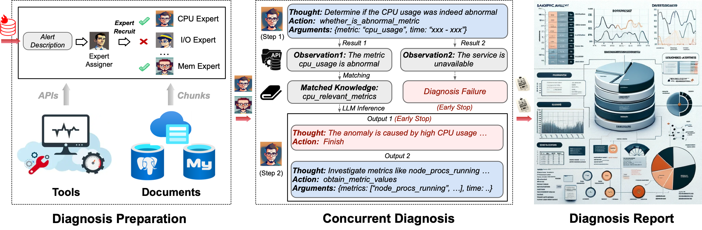
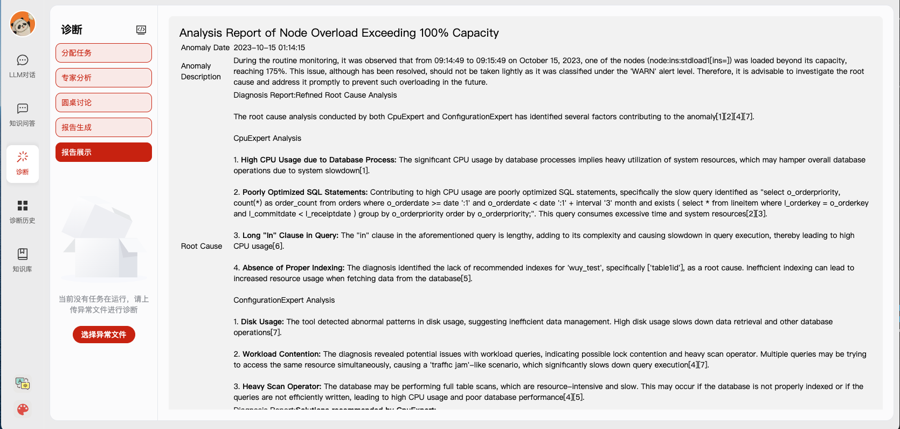
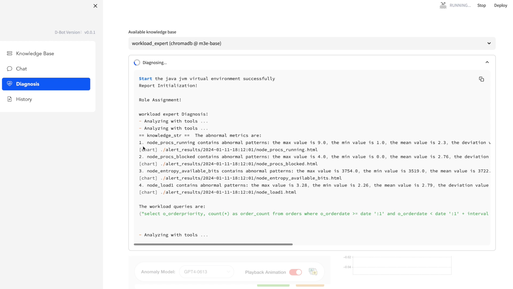
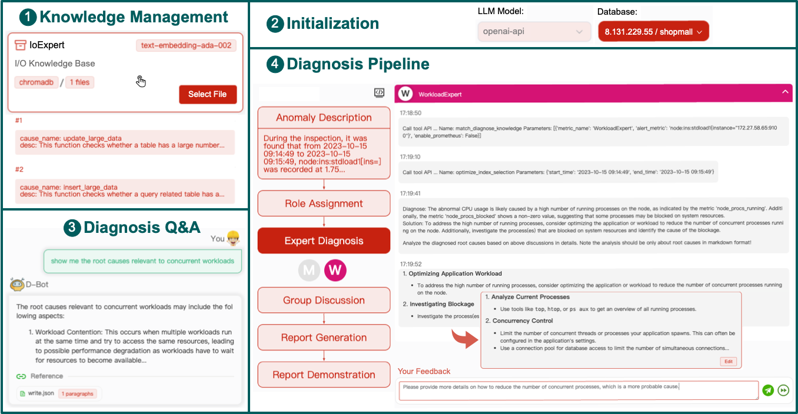
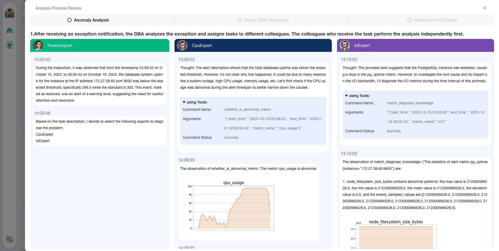
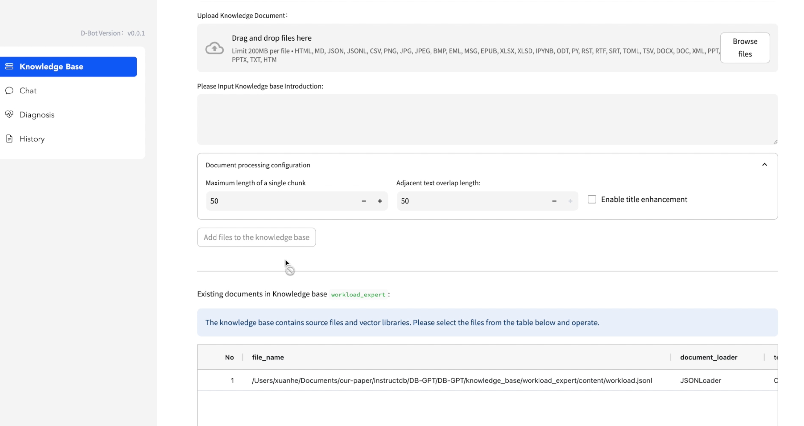
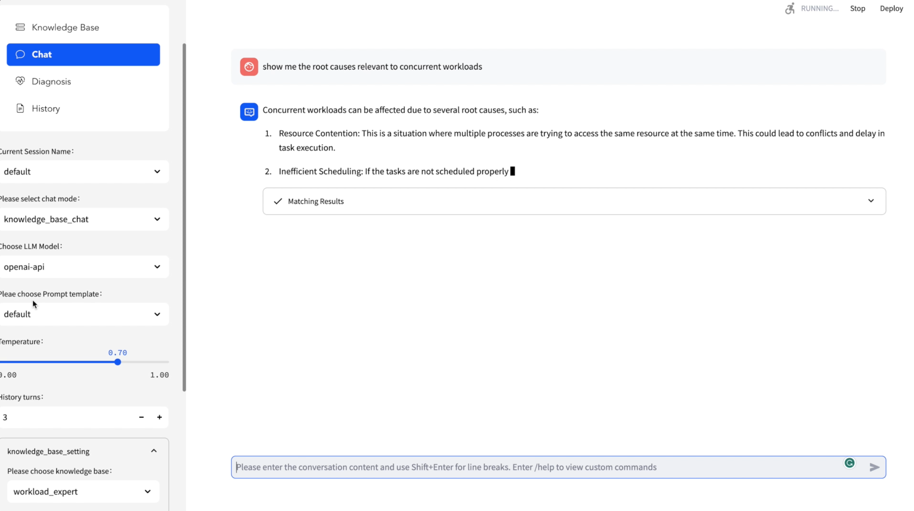
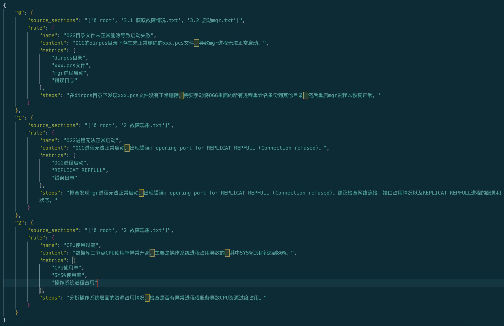
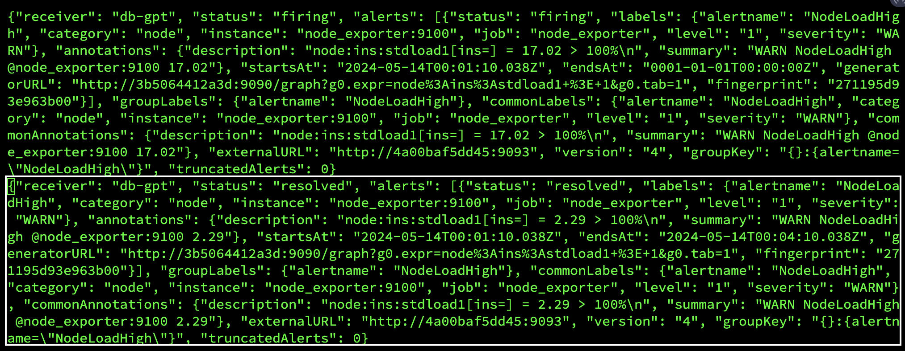

<div align= "center">
    <h1> 数字运维员工</h1>
</div>

<div align="center">

<a href="https://github.com/TsinghuaDatabaseGroup/DB-GPT/tree/main/anomalies/public_testing_set/all_anomalies.jsonl"></a>
<a href="https://github.com/TsinghuaDatabaseGroup/DB-GPT/tree/main/multiagents/tools"></a>
<a href="https://github.com/TsinghuaDatabaseGroup/DB-GPT/tree/main/multiagents/localized_llms/training_data"></a>
<a href="https://cloud.tsinghua.edu.cn/f/6e8a3ad547204303a5ae/?dl=1"></a>
<a href="https://github.com/TsinghuaDatabaseGroup/DB-GPT/tree/main/multiagents/llms"></a>

</div>

<p align="center">
<a href="#-contact">👫 欢迎扫码加入微信群！</a> <bar> <a href="https://www.benchcouncil.org/evaluation/opencs/annual.html#Achievements">🏆 Top 100 开源项目!  <bar> <a href="#-citation">🌟 VLDB 2024!</a> 
</p>

<p align="center">
  <a href="#-demo">演示</a> •
  <a href="#-quickstart">快速开始</a> •
  <a href="#-anomalies">警报与异常</a> •  
  <a href="#-customize">知识与工具</a> • 
  <a href="#-docker">Docker部署</a> •   
  <a href="#-FAQ">常见问题</a> •  
  <a href="#-community">社区</a> •  
  <a href="#-contributors">贡献者</a> •  
  <a href="https://aihomea.com">OpenAI，Azure 聚合API优惠接入方案。</a> 
</p>

<p align="center">
    
</p>

🦾 构建您的个人数据库管理员（D-Bot）🧑‍💻, 擅长通过 *阅读文件，使用各种工具，编写分析报告* 解决数据库问题！   <a href="#-news">*改版中!*</a>


<span id="-demo"></span>

## 🗺 演示效果

1. 启动本地服务后，可以在网页端（采用了[Chatchat](chat.openai.com)项目的前端和配置方式）轻松将文档导入知识库、利用知识库进行有根据的问答、以及利用知识库进行异常告警的诊断分析。

<!-- <p align="center">
  <a href="http://dbgpt.dbmind.cn">
    
  </a>
</p> -->


[](https://vimeo.com/905172621?share=copy)

2. 通过用户反馈功能 [🔗](multiagents/agent_conf/config_feedback.yaml)，您可以（1）给出反馈，使D-Bot跟踪并细化中间诊断结果，以及（2）通过单击“编辑”按钮编辑诊断结果。*D-Bot可以从用户反馈（存储在向量数据库中）中积累优化模式，并自适应用户的诊断偏好。*

<p align="center">
  
</p>

3. 在在线网站（[http://dbgpt.dbmind.cn](http://dbgpt.dbmind.cn)），您可以浏览所有历史诊断结果、使用的指标和详细的诊断过程。

<!-- <p align="center">
  <a href="http://dbgpt.dbmind.cn">
    
  </a>
</p> -->

<p align="center">
  <a href="http://dbgpt.dbmind.cn">
    
  </a>
</p>

*历史版本 1*: [[Gradio for Diag Game]](https://github.com/TsinghuaDatabaseGroup/DB-GPT/tree/old_version) （不依赖langchain）

*历史版本 2*: [[Vue for Report Replay]](https://github.com/TsinghuaDatabaseGroup/DB-GPT/tree/report_replay) （不依赖langchain）


<span id="-news"></span>

## 📰 更新

- [ ] Docker一键部署

    * [x] 指标监控（prometheus）、数据库（postgres_db）、告警（alertmanager）和告警记录（python_app）

    * [ ] D-bot (目前容器过大，超过12GB)

- [ ] 用户反馈机制 🔥🔥🔥

    * [x] 基于用户反馈生成测试优化诊断

    * [x] 优化模式的抽取和管理

- [ ] 语言支持 (英文 / 中文)
    * [x] 默认英文
    * [x] 中文需要在配置config.yaml文件里加上language: zh

- [ ] 前端
    
    * [x] 知识库 + chat问答 + 异常诊断 + 报告回放

- [x] 带引用的诊断报告

- [ ] 加速本地模型（极速版dbot）

    * [x] [*4-bit* 量化LLM](https://huggingface.co/curtis-sun/diag-baichuan2-4bit/tree/main) (推理时间减少1/3)

    * [x] [vllm推理加速](https://github.com/vllm-project/vllm) (qwen)

    * [ ] Tiny LLM

- [x] 文档知识多路抽取
  - [x] 向量数据库 (ChromaDB)
  - [x] RESTful风格的搜索引擎 (Elasticsearch)

- [x] 根据 *知识聚类结果* 自动生成专家描述

- [ ] 升级基于 LLM 的诊断机制:
  - [x] _任务分派 -> 并行诊断 -> 交叉审查 -> 报告生成_
  - [ ] 完善异步机制

<!-- - [x] 添加典型异常和警报 (Pigsty) <a href="#-anomalies">🔗 链接</a>

- [x] 提供端到端框架！<a href="#-diagnosis">🚀 链接</a> -->

- [ ] 在多个层次上支持监控和优化工具 [🔗 链接](multiagents/tools)
  - [x] 监控指标 (Prometheus)
  - [ ] 代码级别的火焰图分析，定位算子、配置等问题
  - [x] 诊断知识检索 (dbmind)
  - [x] 逻辑查询转换 (Calcite)
  - [x] 索引优化算法 (适用于 PostgreSQL)
  - [x] 物理操作符提示 (适用于 PostgreSQL)
  - [ ] 备份和时间点恢复 (Pigsty)

- [x] 我们的愿景论文已发布 (持续更新)
  - _LLM As DBA_ [[论文]](https://arxiv.org/abs/2308.05481) [[中文解读]](https://mp.weixin.qq.com/s/i0-Fdde7DX9YE1jACxB9_Q) [[推特]](https://twitter.com/omarsar0/status/1689811820272353280?s=61&t=MlkXRcM6bNQYHnTIQVUmVw) [[幻灯片]](materials/slides)
  - _DB-GPT: Large Language Model Meets Database_ [[论文]](http://dbgroup.cs.tsinghua.edu.cn/ligl/papers/dbgpt-dse.pdf)

> 该项目正在不断引入新特性 👫👫<br/>
> 不要忘记星标 ⭐ 并关注 👀 以同步最新进展 :)

<span id="-quickstart"></span>

## 🕹 快速开始

### 1. 环境配置

#### 1.1 后端服务配置
+ 首先，确保你的机器安装了 Python (>= 3.10)
```
$ python --version
Python 3.10.12
```
接着，创建一个虚拟环境，并在虚拟环境内安装项目的依赖
```shell

# 拉取仓库
$ git clone https://github.com/TsinghuaDatabaseGroup/DB-GPT.git

# 进入目录
$ cd DB-GPT

# 安装全部依赖
$ pip3 install -r requirements.txt 
$ pip3 install -r requirements_api.txt # 如果只运行API，可以只安装API依赖，请使用 requirements_api.txt

# 默认依赖包括基本运行环境（Chroma-DB向量库）。如果要使用其它向量库，请将 requirements.txt 中相应依赖取消注释再安装。
```

+ PostgreSQL v12 （我们是基于 PostgreSQL v12 进行开发测试的，我们不保证其他版本的 PostgreSQL 的兼容性）

  > 确保您的数据库支持远程连接 ([链接](https://support.cpanel.net/hc/en-us/articles/4419265023383-How-to-enable-remote-PostgreSQL-access))

  > 此外，安装扩展如 _[pg_stat_statements](https://pganalyze.com/docs/install/01_enabling_pg_stat_statements)_（跟踪频繁查询), _[pg_hint_plan](https://pg-hint-plan.readthedocs.io/en/latest/installation.html)_（优化物理操作符), 和 _[hypopg](https://github.com/HypoPG/hypopg)_（创建虚拟索引）。

  > 注意 _pg_stat_statements_ 会持续累积查询统计数据。因此您需要定期清除统计数据：1) 要丢弃所有统计数据，执行 _"SELECT pg_stat_statements_reset();"_; 2) 要丢弃特定查询的统计数据，执行 _"SELECT pg_stat_statements_reset(userid, dbid, queryid);"_。

+ (可选) 如果您需要在本地或离线环境中运行此项目，您首先需要将所需的模型下载到本地计算机，然后进行正确的配置。

1. 下载 [Sentence Trasformer](https://cloud.tsinghua.edu.cn/f/6e8a3ad547204303a5ae/?dl=1) 模型参数

  > 创建新目录 ./multiagents/localized_llms/sentence_embedding/

  > 将下载的sentence-transformer.zip压缩包放置在./multiagents/localized_llms/sentence_embedding/目录下；解压压缩包。


2. 从 [HuggingFace](https://huggingface.co/models) 下载 LLM 和 Embedding 模型。

下载模型需要首先安装 [Git LFS](https://docs.github.com/zh/repositories/working-with-files/managing-large-files/installing-git-large-file-storage)，然后运行

```Shell
$ git lfs install
$ git clone https://huggingface.co/moka-ai/m3e-base
$ git clone https://huggingface.co/Qwen/Qwen-1_8B-Chat
```

3. 调整 [模型设置](configs/model_config.py.example) 为下载路径，如

```Python
EMBEDDING_MODEL = "m3e-base"
LLM_MODELS = ["Qwen-1_8B-Chat"]
MODEL_PATH = {
    "embed_model": {
        "m3e-base": "m3e-base", # Download path of embedding model.
    },

    "llm_model": {
        "Qwen-1_8B-Chat": "Qwen-1_8B-Chat", # Download path of LLM.
    },
}
```

4. 下载并配置 [本地 LLM](multiagents/localized_llms)。

#### 1.2 前端服务配置
+ 首先，确保你的机器安装了 Node (>= 18.15.0)
```
$ node -v
v18.15.0
```
接着，安装项目依赖
```shell
cd webui
# pnpm address https://pnpm.io/zh/motivation
# install dependency(Recommend use pnpm)
# you can  use "npm -g i pnpm" to install pnpm 
pnpm install
```

### 2. 初始化知识库和配置文件

复制配置文件，注意查看每个文件的注释，根据自己需求修改
```shell
$ python copy_config_example.py
# 生成的配置文件在 configs/ 目录下
# basic_config.py 是基础配置文件，不需要修改
# diagnose_config.py 是诊断配置文件，需要根据自己的环境修改。
# kb_config.py 是知识库配置文件，可以修改DEFAULT_VS_TYPE来指定知识库的存储向量库等，也可以修改修改相关的路径。
# model_config.py 是模型配置文件，可以修改LLM_MODELS来指定使用的模型,当前模型配置主要针对知识库搜索，诊断相关的模型还有一些硬编码在代码中，后续会统一到这里。
# prompt_config.py 是prompt配置文件，主要是LLM对话和知识库的prompt。
# server_config.py 是服务配置文件，主要是服务的端口号等。
```

**!!! 注意，请在初始化知识库之前修改以下配置，否则可能会导致数据库初始化失败。**

* model_config.py
```shell
# EMBEDDING_MODEL   向量化模型，如果选择本地模型，需要按需下载到根目录。
# LLM_MODELS        LLM，如果选择本地模型，需要按需下载到根目录。
# ONLINE_LLM_MODEL  如果使用线上模型，需要修改配置。
```

* server_config.py
```shell
# WEBUI_SERVER.api_base_url   需要关注这个参数，如果是在服务器上部署项目，则需要修改配置。
```


初始化知识库
```shell
$ python init_database.py --recreate-vs
 ```

 - 在 [diagnose_config.py](configs/diagnose_config.py.example), 我们将 [config.yaml](multiagents/agent_conf/config.yaml) 设置为LLM专家的默认配置文件。

```Python
DIAGNOSTIC_CONFIG_FILE = "config.yaml"
```

- 要通过用户反馈交互优化诊断，您可以设置
```Python
DIAGNOSTIC_CONFIG_FILE = "config_feedback.yaml"
```

- 要使用 [Qwen](https://github.com/QwenLM/Qwen) 进行中文诊断，您可以设置
```Python
DIAGNOSTIC_CONFIG_FILE = "config_qwen.yaml"
```

### 3. 一键启动

按照以下命令启动项目
```shell
$ python startup.py -a
```
### 4. 启动界面示例

如果正常启动，你将能看到以下界面

1. FastAPI Docs 界面


2. Web UI 启动界面示例：

- Web UI 知识库管理页面：




- Web UI 对话界面：



- Web UI 诊断页面：


## 👩🏻‍⚕️ 异常诊断

<span id="-prerequisites"></span>

通过使用<a href="#-docker">Docker部署</a>节省时间。

#### 1. 先决条件

- (可选) 在 PostgreSQL 中启用慢查询日志 ([链接](https://ubiq.co/database-blog/how-to-enable-slow-query-log-in-postgresql/))

  > (1) 对于 _"systemctl restart postgresql"_，服务名可以不同（例如，postgresql-12.service）;

  > (2) 使用绝对日志路径名称如 _"log_directory = '/var/lib/pgsql/12/data/log'"_;

  > (3) 在 postgresql.conf 中设置 _"log_line_prefix = '%m [%p] [%d]'"_（记录不同查询的数据库名）。

- (可选) Prometheus

  > 查看[prometheus.md](materials/help_documents/prometheus.md)了解详细的安装指南。

#### 2. 诊断

- 测试单个案例
我们在test_case文件夹下面放了多个测试案例。可以通过前端页面选择案例文件，进行诊断，也可以通过命令行进行诊断。
```shell
python3 run_diagnose.py --anomaly_file ./test_cases/testing_cases_5.json --config_file config.yaml
```

- 支持中文qwen调用诊断。请先用vllm在你的gpu机器上部署一个服务，参数配置在configs的model_config修改。如何部署服务请参考[Qwen1.5官方介绍](https://github.com/QwenLM/Qwen1.5)
```shell
python3 run_diagnose.py --anomaly_file ./test_cases/testing_cases_5.json --config_file config_qwen.yaml
```

<span id="-anomalies"></span>

## 🎩 告警和异常

### 告警管理

查看如何快速部署 Prometheus 和 Alertmanager ➡️ [prometheus_service_docker](prometheus_service_docker/README.md)

- 你也可以选择我们提供的docker来进行快速部署（<a href="#-docker">docker deployment</a>）

<!-- 我们支持 Prometheus 的 AlertManager。您可以在这里找到有关如何配置 alertmanager 的更多信息：[alertmanager.md](https://prometheus.io/docs/alerting/latest/configuration/)。

- 我们提供与 AlertManager 相关的配置文件，包括[alertmanager.yml](./prometheus_service_docker/alertmanager.yml)、[node_rules.yml](prometheus_service_docker/node_rules.yml)和[pgsql_rules.yml](prometheus_service_docker/pgsql_rules.yml)。您可以将其部署到您的 Prometheus 服务器以检索相关的异常。
- 我们还提供支持获取警报和指标的服务器，您可以将其部署到您的服务器以获取和存储 Prometheus 的警报和对应时间段内TOP指标。您可以在prometheus_service中获取相关信息。
- [node_rules.yml](prometheus_service_docker/node_rules.yml)和[pgsql_rules.yml](prometheus_service_docker/pgsql_rules.yml)是引用[https://github.com/Vonng/pigsty](https://github.com/Vonng/pigsty)开源项目，他们的监控做得非常好，感谢他们的努力。
- 详细的配置文件请参考[prometheus_service_docker](prometheus_service_docker/README.md)。 -->

### 异常模拟

#### 脚本触发的异常

我们提供可能引起典型异常的脚本。在 [http://dbgpt.dbmind.cn](http://dbgpt.dbmind.cn) 查看不同的异常案例。

| 根本原因              | 描述                        | 可能的警报                                                                                                                  |
| --------------------- | --------------------------- | --------------------------------------------------------------------------------------------------------------------------- |
| INSERT_LARGE_DATA     | 插入大量数据的执行时间较长  |                                                                |
| FETCH_LARGE_DATA      | 获取大量数据的执行时间较长  |                                                                |
| REDUNDANT_INDEX       | 表中不必要且多余的索引      |                                                                |
| VACUUM                | 数据修改导致的未使用空间    |                                                                |
| POOR_JOIN_PERFORMANCE | Join 操作符的性能差         |                                                                |
| CORRELATED_SUBQUERY   | SQL 中不可提升的子查询      | ,           |
| LOCK_CONTENTION       | 锁争用问题                  |           |
| CPU_CONTENTION        | 严重的外部 CPU 资源争用     |                                                                |
| IO_CONTENTION         | 影响 SQL 性能的 IO 资源争用 |   |
| COMMIT_CONTENTION     | 高并发提交影响 SQL 执行     |   |
| SMALL_MEMORY_ALLOC    | 工具分配的内存空间过小      |                                                                                                                             |

#### 手动触发异常

_[点击查看 29 种典型异常与专家分析](./anomaly_trigger/29种性能异常与根因分析.pdf)（由 DBMind 团队支持）_

<span id="-customize"></span>

## 📎 自定义知识和工具

<span id="-doc2knowledge"></span>

### 1. 知识提取

> (1) 如果只需要简单的文档拆分，可以直接使用“知识库管理页面”中的文档导入功能。

> (2) 本功能目前要求文档本身有章节格式信息，目前仅支持docx格式。


步骤 1. 配置 *./doc2knowledge/doc_to_section.py* 中的 *ROOT_DIR_NAME* 路径，并将所有docx格式文档存放在 *ROOT_DIR_NAME* 下。


步骤 2. 配置OPENAI_KEY。

```bash
export OPENAI_API_KEY=XXXXX
```


步骤 2. 按章节索引将文档分割为单独的章节文件。

```bash
cd doc2knowledge/
python doc_to_section.py
```

步骤 3. 修改*doc2knowledge.py*脚本中的参数并运行脚本：

```bash
python doc2knowledge.py
```




<span id="-tools"></span>

### 2. 工具准备

- 工具 API（用于优化）

  | 模块                                                         | 功能          |
  | ------------------------------------------------------------ | ------------- |
  | [index_selection](multiagents/tools/index_advisor)（已装备） | _启发式_ 算法 |
  | [query_rewrite](multiagents/tools/query_advisor)（已装备）   | _45_ 条规则   |
  | [physical_hint](multiagents/tools/query_advisor)（已装备）   | _15_ 个参数   |

  对于[[query_rewrite](multiagents/tools/query_advisor), [physical_hint](multiagents/tools/query_advisor)]内的功能，你可以使用*api_test.py* 脚本来验证其有效性。

  如果功能确实有效，请将其添加到相应模块的*api.py*中。

<span id="-FAQ"></span>

#### 索引顾问工具

我们使用db2advis启发式算法为给定的工作负载推荐索引。函数api是[optimize_index_selection](multiagents/tools/index_advisor)。


<span id="-docker"></span>

## 🐳 Docker 启动

您可以使用 Docker 快速、安全地使用监控平台和数据库。

### 1. 安装 Docker 和 Docker-Compose

请参考教程（例如在 [CentOS](https://vocus.cc/article/643e9337fd89780001b414fc) 上）安装 Docker 和 Docker-Compose。

### 2. 启动服务

我们使用 docker-compose 来构建和管理多个用于指标监控（prometheus）、告警（alertmanager）、数据库（postgres_db）和告警记录（python_app）的 Docker 容器。

```shell
cd prometheus_service_docker
docker-compose -p prometheus_service -f docker-compose.yml up --build
```

> 下次启动 prometheus_service 时，您可以直接执行 "docker-compose -p prometheus_service -f docker-compose.yml up"，而无需重新构建 Docker 容器。

### 3. 运行异常文件并生成新告警

在*anomaly_trigger/utils/database.py*中配置设置（例如，将 "host" 替换为服务器的 IP 地址），并执行异常生成命令，如：

```shell
cd anomaly_trigger
python3 main.py --anomaly MISSING_INDEXES --threads 100 --ncolumn 20 --colsize 100 --nrow 20000
```

> 如果执行后没有记录告警，您可能需要修改参数值，例如 "--threads 100"。

在收到从 prometheus_service 发送到 http://127.0.0.1:8023/alert 的请求后，告警摘要将记录在 prometheus_and_db_docker/alert_history.txt 中，如：

<p align="center">
    
</p>

这样，您可以使用标记为 resolved 的告警作为新的异常（存放在 ./diagnostic_files 目录下）由 d-bot 进行诊断。


## 💁 常见问题解答

<details><summary><b>🤨 '.sh' 脚本命令无法在Windows系统上执行。</b></summary>
将Shell切换到*git bash*或使用*git bash*来执行'.sh'脚本。
</details>

<details><summary><b>🤨 Windows系统上出现“找不到名为'xxx'的模块”。</b></summary>
这个错误是由Python运行时环境路径问题引起的。你需要进行以下步骤：

步骤 1：检查环境变量。

<div align="center">

</div>

你必须在环境变量中配置"Scripts"。

步骤 2：检查 IDE 设置。

对于 VS Code，下载 Python 扩展。对于 PyCharm，为当前项目指定 Python 版本。

</details>

## ⏱ 待办事项

- ~~项目清理~~
- ~~支持更多异常~~
- 根据匹配的知识严格限制 llm 输出（过多不相关信息）
- ~~查询日志选项（可能会占用磁盘空间，我们需要仔细考虑）~~
- ~~添加更多通信机制~~
- ~~支持更多知识来源~~
- ~~项目工程化，解决依赖问题和代码中的硬编码问题~~
- ~~独立知识抽取模块~~
- 达到 D-bot(gpt4)能力的本地化模型
- 支持其他数据库（例如，mysql/redis）

<span id="-community"></span>

## 👫 社区

- [清华大学](https://www.tsinghua.edu.cn/en/)
- [面壁科技](https://modelbest.cn/)
- [Pigsty](https://pigsty.cc/)
- [云和恩墨](https://enmotech.com/)

<span id="-projects"></span>

## 🤗 相关项目

https://github.com/OpenBMB/AgentVerse

https://github.com/Vonng/pigsty

https://github.com/UKPLab/sentence-transformers

https://github.com/chatchat-space/Langchain-Chatchat

https://github.com/shreyashankar/spade-experiments

<span id="-citation"></span>

## 📒 引用


```bibtex
@misc{zhou2023llm4diag,
      title={LLM As DBA},
      author={Xuanhe Zhou, Guoliang Li, Zhiyuan Liu},
      year={2023},
      eprint={2308.05481},
      archivePrefix={arXiv},
      primaryClass={cs.DB}
}
```

```bibtex
@misc{zhou2023dbgpt,
      title={DB-GPT: 大型语言模型遇上数据库},
      author={Xuanhe Zhou, Zhaoyan Sun, Guoliang Li},
      year={2023},
      archivePrefix={Data Science and Engineering},
}
```

<span id="-contributors"></span>

## 📧 贡献者

<a href="https://github.com/TsinghuaDatabaseGroup/DB-GPT/network/dependencies">
  
</a>

其他合作者: [Wei Zhou](https://github.com/Beliefuture), [Kunyi Li](https://github.com/LikyThu)。

我们感谢所有对这个项目的贡献者。如果你想参与或贡献，不要犹豫！

<span id="-contact"></span>

## 联系我们
👏🏻欢迎加入我们的微信群，如该二维码过期，可添加微信号：ming621431。<span style="color: red">请一定要备注 [DB-GPT]!!!</span>
<div align= "center">

</div>
